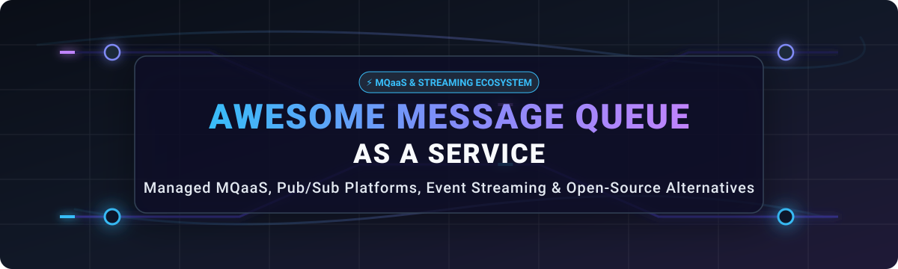

# 🚀 Awesome Message Queue as a Service (MQaaS)

<p align="center">
  
</p>

<p align="center">
  <a href="https://github.com/ishandutta2007/Awesome-Awesome-Awesome"></a>
  <a href="https://discord.gg/jc4xtF58Ve"></a>
  <a href="https://github.com/ishandutta2007/Awesome-Awesome-Awesome"></a>
  <a href="LICENSE"></a>
  <a href="https://github.com/ishandutta2007/Awesome-Message-Queue-As-A-Service/pulls"></a>
  <a href="https://github.com/ishandutta2007/Awesome-Message-Queue-As-A-Service/stargazers"></a>
  <a href="https://github.com/ishandutta2007"></a>
</p>

---

## 💡 Overview & SEO Guide

A **Message Queue as a Service (MQaaS)** platform provides cloud-managed infrastructure for asynchronous communication, microservices decoupling, event streaming, task queues, and IoT telemetry across distributed cloud architectures.

This curated ecosystem reference covers **managed cloud MQaaS platforms**, **serverless event buses**, **pub/sub streaming brokers**, and their **open-source / self-hosted equivalents** (such as Apache Kafka, RabbitMQ, NATS, Pulsar, and Redis).

---

## 📑 Table of Contents

- [☁️ SaaS / Hosted MQaaS Platforms](#-saas--hosted-mqaas-platforms)
- [📦 Open-Source Message Brokers & Streaming](#-open-source-message-brokers--streaming)
- [🔄 Commercial → Open-Source Mapping](#commercial--open-source-mapping)
- [📊 Message Queue Capability Matrix](#message-queue-capability-matrix)
- [🏗️ Recommended Open-Source Architecture](#recommended-open-source-architecture)
- [📐 Messaging Patterns & Lifecycle](#messaging-patterns)
- [🤝 How to Contribute](#how-to-contribute)

---

## ☁️ SaaS / Hosted MQaaS Platforms

📊 **Sector Market Analysis & Industry Dynamics**: The global Message Queue and Middleware / Message Queue as a Service (MQaaS) market size is estimated at approximately **$12.5 Billion in 2026** (expanding at a ~14.2% CAGR). The market structure is **moderately fragmented**, featuring dominant cloud hyperscalers (AWS SQS, Azure Service Bus, GCP Pub/Sub) alongside hyper-specialized streaming/real-time providers (Confluent Cloud, Redpanda, Ably, PubNub) and cloud-native managed open-source platforms.

| Rank | Platform 🌐 | Category 📌 | Company Size (Valuation / ARR) 🏢 | Starting Pricing Tier 💰 | Free Tier Limit / Trial 🆓 | Open-Source Alternatives 🔄 |
| :--- | :--- | :--- | :--- | :--- | :--- | :--- |
| 1 | **Amazon SQS** | Managed Queueing | ~$2.0 Trillion Valuation / ~$105B AWS ARR | $0.40 per 1,000,000 requests | 1,000,000 requests/month (Always Free) | RabbitMQ, NATS, LavinMQ, Beanstalkd |
| 2 | **Azure Service Bus** | Enterprise Messaging | ~$3.0 Trillion Valuation / ~$65B Azure ARR | $0.05 per 10,000 operations | 1,000,000 operations/month (12-Mo Trial + $200 Credit) | Apache ActiveMQ Artemis, RabbitMQ, NATS |
| 3 | **Google Cloud Pub/Sub** | Managed Pub/Sub | ~$2.0 Trillion Valuation / ~$43B GCP ARR | $40.00 per TB ($0.04/GB) | 10 GB data transfer/month (Always Free) | Apache Pulsar, Apache Kafka, NATS JetStream |
| 4 | **RabbitMQ Cloud** | Managed AMQP | ~$800 Billion Valuation / ~$50B Broadcom ARR | $0.15 per hour (~$108/mo) | 30-day free trial on Tanzu Network / AWS Marketplace | RabbitMQ, LavinMQ, Apache ActiveMQ |
| 5 | **Confluent Cloud** | Event Streaming (Kafka) | ~$6.5 Billion Valuation / ~$1.0B ARR | $0.10 per GB transferred | $400 free credit valid for 30 days | Apache Kafka, Apache Pulsar, Redpanda |
| 6 | **Aiven RabbitMQ** | Managed Messaging | ~$3.0 Billion Valuation / ~$100M ARR | $0.027 per hour (~$19.44/mo) | 30-day free trial with $300 credit | RabbitMQ, LavinMQ, ActiveMQ Artemis |
| 7 | **Redpanda Cloud** | Kafka-Compatible Streaming | ~$500 Million Valuation / ~$30M ARR | $0.08 per GB + compute | 14-day free trial with $300 credit | Redpanda Community, Apache Kafka, Apache Pulsar |
| 8 | **PubNub** | Realtime Pub/Sub | ~$300 Million Valuation / ~$50M ARR | $49.00 per month (Starter) | 200 Monthly Active Users & 1M messages/mo (Always Free) | NATS, Centrifugo, EMQX, Mosquitto |
| 9 | **Ably** | Realtime Pub/Sub | ~$250 Million Valuation / ~$30M ARR | $29.00 per month (Pay-As-You-Go) | 6,000,000 message deliveries & 200 connections/mo (Always Free) | NATS, Apache Pulsar, Centrifugo, Mercure |
| 10 | **HiveMQ Cloud** | Managed MQTT | ~$200 Million Valuation / ~$25M ARR | $1.50 per GB transferred | 100 MQTT device connections & 10 GB data/mo (Always Free) | EMQX, Eclipse Mosquitto, NanoMQ, VerneMQ |
| 11 | **Upstash QStash** | Serverless Queueing | ~$100 Million Valuation / ~$15M ARR | $1.00 per 100,000 requests | 500 messages/day (15,000 messages/month) (Always Free) | NATS JetStream, BullMQ + Redis, Temporal |
| 12 | **NATS.io Cloud** | Cloud-Native Pub/Sub | ~$80 Million Valuation / ~$10M ARR | $0.50 per GB transferred ($19/mo Developer) | 10 GB data transfer/mo & 3 stream replicas (Always Free) | NATS Server, NATS JetStream |
| 13 | **CloudAMQP** | Hosted RabbitMQ | ~$75 Million Valuation / ~$20M ARR | $0.007 per hour (~$5/mo) | 1,000,000 messages/month & 20 connections (Always Free) | RabbitMQ, LavinMQ, ActiveMQ Artemis |
| 14 | **Memphis.dev** | Cloud Message Broker | ~$30 Million Valuation / ~$5M ARR | $0.08 per GB transferred | 14-day free trial or 50 GB storage free tier | Memphis Open Source, Apache Pulsar, NATS |
| 15 | **IronMQ** | Cloud Task Queues | ~$25 Million Valuation / ~$5M ARR | $24.00 per month (Starter) | 14-day free trial with full feature access | RabbitMQ, Beanstalkd, LavinMQ |

---

## 📦 Open-Source Message Brokers & Streaming

Self-hosted and open-source message queues form the backbone of modern distributed systems. Repositories below are ordered by **GitHub Star Count (Descending)**, with each star badge linking directly to the repo's stargazers page:

### 1. Redis [](https://github.com/redis/redis/stargazers)
- **Repository:** https://github.com/redis/redis
- **License:** BSD-3-Clause / RSALv2
- **Description:** In-memory data structure store used as a distributed message broker, pub/sub engine, and high-performance queue (Streams & List data structures).
- **Features:** Pub/Sub channels, Redis Streams, Consumer Groups, In-Memory speed, Persistence (RDB/AOF), Lua scripting.

---

### 2. Apache Kafka [](https://github.com/apache/kafka/stargazers)
- **Repository:** https://github.com/apache/kafka
- **License:** Apache 2.0
- **Description:** Distributed event streaming platform used for high-throughput event pipelines, streaming analytics, data integration, and event-driven microservices.
- **Features:** Partitioned log storage, Consumer groups, KRaft consensus, Kafka Connect, Kafka Streams, Exactly-once processing.

---

### 3. Celery [](https://github.com/celery/celery/stargazers)
- **Repository:** https://github.com/celery/celery
- **License:** BSD-3-Clause
- **Description:** Asynchronous task queue/job queue based on distributed message passing (RabbitMQ, Redis, Amazon SQS).
- **Features:** Task scheduling, Workflows (chains, groups, chords), Rate limiting, Auto-retry, Multiple result backends.

---

### 4. Sidekiq [](https://github.com/mperham/sidekiq/stargazers)
- **Repository:** https://github.com/mperham/sidekiq
- **License:** LGPL-3.0 / Commercial
- **Description:** Simple, efficient background processing for Ruby powered by Redis.
- **Features:** Multithreaded execution, Retries, Scheduled jobs, Web UI dashboard, High concurrency.

---

### 5. Apache RocketMQ [](https://github.com/apache/rocketmq/stargazers)
- **Repository:** https://github.com/apache/rocketmq
- **License:** Apache 2.0
- **Description:** Low latency, high throughput, distributed message and streaming platform with ordered, delayed, and transactional messaging.
- **Features:** Strict message ordering, Scheduled/delayed messages, Distributed transactions, DLQ support, High availability.

---

### 6. Valkey [](https://github.com/valkey-io/valkey/stargazers)
- **Repository:** https://github.com/valkey-io/valkey
- **License:** BSD-3-Clause
- **Description:** Open-source high-performance data structure server supporting pub/sub, streams, and queueing under the Linux Foundation.
- **Features:** 100% open-source BSD license, Redis API drop-in compatibility, Multithreaded IO, Streams & Pub/Sub.

---

### 7. NATS Server [](https://github.com/nats-io/nats-server/stargazers)
- **Repository:** https://github.com/nats-io/nats-server
- **License:** Apache 2.0
- **Description:** Cloud-native messaging system supporting core pub/sub, request-reply, and JetStream persistent stream engine.
- **Features:** Lightweight single binary, JetStream persistence, Key-Value store, Object store, Multi-tenancy account security.

---

### 8. EMQX [](https://github.com/emqx/emqx/stargazers)
- **Repository:** https://github.com/emqx/emqx
- **License:** Apache 2.0
- **Description:** Scalable, enterprise-grade open-source MQTT message broker for IoT, IIoT, and connected vehicles.
- **Features:** 100M+ concurrent MQTT connections, SQL-based data rule engine, MQTT 5.0 / 3.1.1 support, Low latency.

---

### 9. Apache Pulsar [](https://github.com/apache/pulsar/stargazers)
- **Repository:** https://github.com/apache/pulsar
- **License:** Apache 2.0
- **Description:** Distributed pub/sub messaging and event-streaming platform featuring multi-tenancy, geo-replication, and tiered storage.
- **Features:** Decoupled compute and storage (BookKeeper), Native multi-tenancy, Geo-replication, Tiered S3 storage, Pulsar Functions.

---

### 10. Temporal [](https://github.com/temporalio/temporal/stargazers)
- **Repository:** https://github.com/temporalio/temporal
- **License:** MIT
- **Description:** Durable execution platform and workflow engine eliminating complex queue orchestration for long-running workflows.
- **Features:** Code-as-configuration workflows, Stateful execution, Guaranteed completion, Retries, SDKs for Go, Java, Python, TS.

---

### 11. RabbitMQ [](https://github.com/rabbitmq/rabbitmq-server/stargazers)
- **Repository:** https://github.com/rabbitmq/rabbitmq-server
- **License:** MPL 2.0
- **Description:** De-facto standard open-source message broker supporting AMQP 0-9-1, AMQP 1.0, MQTT, STOMP, streams, and clustering.
- **Features:** Exchanges (Direct, Fanout, Topic, Headers), Dead-letter exchanges, Priority queues, Quorum queues, Web Management UI.

---

### 12. Redpanda [](https://github.com/redpanda-data/redpanda/stargazers)
- **Repository:** https://github.com/redpanda-data/redpanda
- **License:** BSL 1.1 / Source Available
- **Description:** C++ re-imagination of Kafka-compatible event streaming operating without JVM or ZooKeeper.
- **Features:** 100% Kafka API compatible, Thread-per-core engine, Built-in Schema Registry, WASM data transforms.

---

### 13. Eclipse Mosquitto [](https://github.com/eclipse-mosquitto/mosquitto/stargazers)
- **Repository:** https://github.com/eclipse-mosquitto/mosquitto
- **License:** EPL 2.0 / EDL 1.0
- **Description:** Lightweight C-based MQTT message broker suitable for low-power single-board computers and IoT edge devices.
- **Features:** MQTT v5.0, v3.1.1, v3.1 support, Minimal memory footprint, SSL/TLS security, WebSockets support.

---

### 14. Asynq [](https://github.com/hibiken/asynq/stargazers)
- **Repository:** https://github.com/hibiken/asynq
- **License:** MIT
- **Description:** Simple, reliable, and efficient distributed task queue for Go applications powered by Redis.
- **Features:** Guaranteed at-least-once execution, Scheduled tasks, Task retries, Rate limiting, CLI & Web Monitoring UI.

---

### 15. ZeroMQ [](https://github.com/zeromq/libzmq/stargazers)
- **Repository:** https://github.com/zeromq/libzmq
- **License:** MPL 2.0
- **Description:** High-performance asynchronous messaging library for brokerless distributed and concurrent application design.
- **Features:** Brokerless architecture, Sockets over inproc, IPC, TCP, PGM, Microsecond latency, Multi-language bindings.

---

### 16. Centrifugo [](https://github.com/centrifugal/centrifugo/stargazers)
- **Repository:** https://github.com/centrifugal/centrifugo
- **License:** MIT
- **Description:** Scalable real-time messaging server (WebSockets, SockJS, gRPC, SSE) for cross-platform app notifications.
- **Features:** Channel-based pub/sub, JWT authentication, Presence & history, Redis / KeyDB scale-out backend.

---

### 17. BullMQ [](https://github.com/taskforcesh/bullmq/stargazers)
- **Repository:** https://github.com/taskforcesh/bullmq
- **License:** MIT
- **Description:** Fast and reliable message queue & batch job processing library for NodeJS and Python based on Redis.
- **Features:** Delayed jobs, Parent-child job dependencies, Concurrency control, Rate limiting, Repeatable CRON jobs.

---

### 18. Watermill [](https://github.com/ThreeDotsLabs/watermill/stargazers)
- **Repository:** https://github.com/ThreeDotsLabs/watermill
- **License:** MIT
- **Description:** Go library for efficiently processing event streams, supporting Kafka, RabbitMQ, NATS, and Google Cloud Pub/Sub.
- **Features:** Event-driven architecture, Pub/Sub abstraction, CQRS support, Router middleware, Metrics & Tracing.

---

### 19. Beanstalkd [](https://github.com/beanstalkd/beanstalkd/stargazers)
- **Repository:** https://github.com/beanstalkd/beanstalkd
- **License:** MIT
- **Description:** Fast, general-purpose in-memory work queue service originally designed to reduce latency in web applications.
- **Features:** Tube-based queueing, Job priorities, TTR (time-to-run) timeouts, Delayed jobs, Zero dependencies.

---

### 20. Memphis Open Source [](https://github.com/memphisdev/memphis/stargazers)
- **Repository:** https://github.com/memphisdev/memphis
- **License:** Apache 2.0
- **Description:** Next-generation alternative to traditional message brokers with built-in dead-letter management and schema enforcement.
- **Features:** Embedded dead-letter management, Real-time message tracking, Protobuf/JSON Schema enforcement, K8s native.

---

### 21. Dramatiq [](https://github.com/Bogdanp/dramatiq/stargazers)
- **Repository:** https://github.com/Bogdanp/dramatiq
- **License:** LGPL-3.0
- **Description:** Fast and reliable background task processing library for Python 3 with Redis or RabbitMQ backends.
- **Features:** Low overhead, Automatic retries with exponential backoff, Rate limiting, Delayed tasks, Actor model design.

---

### 22. VerneMQ [](https://github.com/vernemq/vernemq/stargazers)
- **Repository:** https://github.com/vernemq/vernemq
- **License:** Apache 2.0
- **Description:** High-performance, distributed MQTT message broker written in Erlang for enterprise IoT connectivity.
- **Features:** Masterless clustering, High message throughput, Webhooks integration, Plugin architecture.

---

### 23. LavinMQ [](https://github.com/cloudamqp/lavinmq/stargazers)
- **Repository:** https://github.com/cloudamqp/lavinmq
- **License:** Apache 2.0
- **Description:** Extremely fast AMQP 0-9-1 message broker written in Crystal, achieving high throughput with minimal memory overhead.
- **Features:** Handles millions of messages/sec, Ultra-low memory usage, AMQP 0-9-1 protocol, Built-in HTTP management UI.

---

### 24. NanoMQ [](https://github.com/emqx/nanomq/stargazers)
- **Repository:** https://github.com/emqx/nanomq
- **License:** MIT
- **Description:** Ultra-lightweight edge MQTT broker designed for IoT, embedded Linux, and edge compute platforms.
- **Features:** Actor model architecture, Memory footprint < 10MB, Built-in MQTT bridging to cloud brokers.

---

### 25. Apache ActiveMQ Artemis [](https://github.com/apache/activemq-artemis/stargazers)
- **Repository:** https://github.com/apache/activemq-artemis
- **License:** Apache 2.0
- **Description:** Non-blocking asynchronous enterprise message broker supporting AMQP, MQTT, STOMP, and JMS 2.0 protocols.
- **Features:** High-performance journaled storage, Multi-protocol support, Clustered high availability, Shared-nothing replication.

---

### 26. KubeMQ Community [](https://github.com/kubemq-io/kubemq-community/stargazers)
- **Repository:** https://github.com/kubemq-io/kubemq-community
- **License:** Apache 2.0
- **Description:** Kubernetes-native message broker and message queue container engineered for microservices container orchestration.
- **Features:** Small footprint (<30MB image), Supports Queues, Pub/Sub, Events, Command/Query patterns, Built-in tracing.

---

# Commercial → Open-Source Mapping


| SaaS / Hosted Platform  | Primary Capability          | Open-Source Building Blocks         |

| ----------------------- | --------------------------- | ----------------------------------- |

| CloudAMQP               | Managed RabbitMQ            | RabbitMQ / LavinMQ                  |

| Ably                    | Realtime Pub/Sub            | NATS / Pulsar / Centrifugo          |

| PubNub                  | Realtime messaging          | NATS / Pulsar / EMQX                |

| Amazon SQS              | Managed queues              | RabbitMQ / NATS JetStream / Artemis |

| Azure Service Bus       | Enterprise messaging        | RabbitMQ / Artemis / Qpid           |

| Google Cloud Pub/Sub    | Managed Pub/Sub             | Pulsar / NATS / Kafka               |

| IronMQ                  | Hosted queues               | RabbitMQ / NATS / Beanstalkd        |

| HiveMQ Cloud            | Managed MQTT                | EMQX / Mosquitto / VerneMQ          |

| Upstash QStash          | HTTP messaging / scheduling | NATS / RabbitMQ / Temporal          |

| RabbitMQ Cloud          | Managed RabbitMQ            | RabbitMQ                            |

| NATS Cloud              | Managed NATS                | NATS Server + JetStream             |

| Memphis.dev             | Queue/event platform        | NATS / Pulsar / Kafka               |

| Aiven RabbitMQ          | Managed RabbitMQ            | RabbitMQ                            |

| Redpanda Cloud          | Event streaming             | Apache Kafka / Pulsar               |

| Confluent Cloud         | Managed Kafka               | Apache Kafka                        |

| MQTT SaaS               | IoT messaging               | EMQX / Mosquitto / VerneMQ          |

| Managed task queues     | Background jobs             | Celery / BullMQ / RabbitMQ          |

| Managed workflow queues | Durable execution           | Temporal                            |

| Managed integration     | Message routing             | Apache Camel / Node-RED             |


---


# Message Queue Capability Matrix


| Capability        |   RabbitMQ |         NATS |        Kafka |          Pulsar |    Artemis |    RocketMQ |       EMQX |    SQS-like |

| ----------------- | ---------: | -----------: | -----------: | --------------: | ---------: | ----------: | ---------: | ----------: |

| Traditional Queue |          ✅ |            ✅ |           ⚠️ |               ✅ |          ✅ |           ✅ |         ⚠️ |           ✅ |

| Pub/Sub           |          ✅ |            ✅ |            ✅ |               ✅ |          ✅ |           ✅ |          ✅ |          ⚠️ |

| Event Streaming   |         ⚠️ |            ✅ |            ✅ |               ✅ |         ⚠️ |           ✅ |         ⚠️ |          ⚠️ |

| MQTT              |     Plugin |            ❌ |            ❌ |          Plugin |          ✅ |      Plugin |          ✅ |           ❌ |

| AMQP              |          ✅ |            ❌ |            ❌ |          Plugin |          ✅ |           ❌ |          ❌ |         API |

| Persistence       |          ✅ |            ✅ |            ✅ |               ✅ |          ✅ |           ✅ |          ✅ |           ✅ |

| Consumer Groups   |         ⚠️ |            ✅ |            ✅ |               ✅ |         ⚠️ |           ✅ |         ⚠️ |         N/A |

| Replay            |         ⚠️ |            ✅ |            ✅ |               ✅ |         ⚠️ |           ✅ |         ⚠️ |     Limited |

| Ordering          |          ✅ |            ✅ |    Partition |       Partition |          ✅ |           ✅ |      Topic | FIFO option |

| DLQ               |          ✅ |            ✅ |      Pattern |               ✅ |          ✅ |           ✅ |      Rules |           ✅ |

| Delayed Delivery  |     Plugin |      Pattern |      Pattern |         Pattern |          ✅ |           ✅ | Rule-based |           ✅ |

| Transactions      |          ✅ |      Pattern |            ✅ |               ✅ |          ✅ |           ✅ |    Limited |     Limited |

| Multi-Region      | Federation | Cluster/Leaf |  Replication | Geo-replication | Federation | Replication |    Cluster |       Cloud |

| HTTP API          |     Plugin |          API | REST/clients |             API | Management |         API |        API |           ✅ |

| WebSockets        |     Plugin |      Gateway |      Gateway |         Gateway |     Plugin |     Gateway |          ✅ |           ❌ |

| IoT               |       Good |         Good |         Good |            Good |       Good |        Good |  Excellent |     Limited |

| Cloud Native      |  Excellent |    Excellent |    Excellent |       Excellent |       Good |        Good |  Excellent |   Excellent |


---


# Recommended Open-Source Architecture


```text

                         ┌──────────────────────────────┐

                         │        Applications          │

                         │ Web / Mobile / API / IoT    │

                         └──────────────┬───────────────┘

                                        │

                              HTTP / gRPC / MQTT

                                        │

                                        ▼

                         ┌──────────────────────────────┐

                         │     API / Gateway Layer      │

                         │ NGINX / Envoy / Node-RED    │

                         └──────────────┬───────────────┘

                                        │

                    ┌───────────────────┼───────────────────┐

                    │                   │                   │

                    ▼                   ▼                   ▼

             ┌───────────┐      ┌────────────┐      ┌────────────┐

             │ RabbitMQ  │      │    NATS    │      │   Pulsar   │

             │   Queue   │      │ JetStream  │      │  Streaming │

             └─────┬─────┘      └──────┬─────┘      └──────┬─────┘

                   │                   │                   │

                   └───────────────────┼───────────────────┘

                                       │

                                       ▼

                             ┌─────────────────┐

                             │ Worker / Stream │

                             │   Processing    │

                             └────────┬────────┘

                                      │

                       ┌──────────────┼──────────────┐

                       ▼              ▼              ▼

                   PostgreSQL       Redis         Analytics

```


---


# Best Open-Source Combinations


## 1. Amazon SQS-style Queue


```text

RabbitMQ

    +

RabbitMQ Management

    +

Prometheus

    +

Grafana

```


Alternative:


```text

NATS

    +

JetStream

    +

Prometheus

    +

Grafana

```


---


## 2. Azure Service Bus-style Enterprise Messaging


```text

RabbitMQ

    +

Apache ActiveMQ Artemis

    +

Apache Camel

    +

PostgreSQL

    +

Prometheus

    +

Grafana

```


---


## 3. Google Pub/Sub-style Architecture


```text

Apache Pulsar

      +

Pulsar Functions

      +

Connectors

      +

Schema Management

      +

Prometheus

      +

Grafana

```


---


## 4. Ably / PubNub-style Realtime Messaging


```text

NATS

   +

WebSocket Gateway

   +

Centrifugo

   +

Redis / Valkey

   +

PostgreSQL

   +

Grafana

```


---


## 5. CloudAMQP / RabbitMQ Cloud Alternative


```text

RabbitMQ Cluster

       +

RabbitMQ Management

       +

HAProxy / Load Balancer

       +

Prometheus

       +

Grafana

       +

Kubernetes

```


---


## 6. HiveMQ Cloud Alternative


```text

EMQX Cluster

      +

MQTT

      +

WebSocket

      +

Rule Engine

      +

PostgreSQL

      +

Prometheus

      +

Grafana

```


---


## 7. Upstash QStash Alternative


```text

HTTP API

    │

    ▼

NATS / RabbitMQ

    │

    ├── Retry

    ├── Delay

    ├── DLQ

    └── Worker

         │

         ▼

       API

```


For durable workflow requirements:


```text

Application

     │

     ▼

Temporal

     │

     ├── Retry

     ├── Scheduling

     ├── Timeout

     └── Workflow State

```


---


# Messaging Patterns


## Point-to-Point


```text

Producer

   │

   ▼

Queue

   │

   ▼

Consumer

```


Only one consumer normally processes each message.


---


## Publish / Subscribe


```text

                 ┌── Consumer A

                 │

Publisher ─ Topic ├── Consumer B

                 │

                 └── Consumer C

```


---


## Work Queue


```text

                 ┌── Worker A

                 │

Producer → Queue ├── Worker B

                 │

                 └── Worker C

```


---


## Fan-Out


```text

                  ┌── Service A

                  │

Event → Exchange ─┼── Service B

                  │

                  └── Service C

```


---


## Request / Reply


```text

Client

  │

  ▼

Request

  │

  ▼

Service

  │

  ▼

Response

```


NATS and ZeroMQ are particularly suitable for this communication pattern.


---


# Queue Lifecycle


```text

Producer

   │

   ▼

Message Created

   │

   ▼

Message Accepted

   │

   ▼

Queue / Topic

   │

   ├── Retry

   ├── Delay

   ├── Priority

   └── Expiration

   │

   ▼

Consumer

   │

   ▼

Processing

   │

   ├── ACK

   │

   ├── NACK

   │

   └── Failure

         │

         ▼

       Retry

         │

         ▼

        DLQ

```


---


# Message Delivery Semantics


## At-Most-Once


```text

Message → Consumer

          │

          └── No retry

```


Possible outcome:


```text

Message may be lost

```


Useful where duplicates are more harmful than loss.


---


## At-Least-Once


```text

Message

   │

   ▼

Consumer

   │

   ├── ACK → Complete

   │

   └── Failure → Retry

```


Possible outcome:


```text

Duplicate delivery

```


This is the most common practical model for reliable distributed systems.


---


## Exactly-Once


Exactly-once semantics generally require coordination across:


* Producer

* Broker

* Consumer

* Storage

* Transactions

* Idempotency


A practical design often combines:


```text

At-Least-Once Delivery

        +

Idempotent Consumer

        +

Transactional / Atomic State Update

```


---


# Dead-Letter Queue Architecture


```text

                ┌──────────────┐

                │    Queue     │

                └──────┬───────┘

                       │

                    Consumer

                       │

                 ┌─────┴─────┐

                 │           │

                ACK        Failure

                 │           │

                 ▼           ▼

              Success      Retry

                               │

                               ▼

                         Retry Limit

                               │

                               ▼

                             DLQ

```


DLQ should preserve:


* Original message

* Original queue/topic

* Failure reason

* Retry count

* Timestamp

* Consumer identity

* Correlation ID


---


# Retry Architecture


```text

Message

   │

   ▼

Attempt 1

   │

 Failure

   ▼

Delay

   │

   ▼

Attempt 2

   │

 Failure

   ▼

Exponential Backoff

   │

   ▼

Attempt N

   │

 Failure

   ▼

DLQ

```


Recommended strategy:


```text

delay = min(maxDelay, baseDelay × 2^retryCount)

```


Add jitter to avoid synchronized retry storms.


---


# Priority Queue Architecture


```text

                 ┌── High Priority

Producer ────────┼── Normal Priority

                 └── Low Priority

                        │

                        ▼

                     Workers

```


RabbitMQ, Artemis and several queue systems support priority-oriented designs.


---


# Delayed Messaging


Typical use cases:


* Scheduled notifications

* Retry backoff

* Payment retries

* Reminder systems

* Delayed workflows

* Rate limiting


```text

Producer

   │

   ▼

Delayed Queue

   │

   ▼

Timer / TTL

   │

   ▼

Processing Queue

   │

   ▼

Consumer

```


---


# Pub/Sub Architecture


```text

                       ┌── Subscriber A

                       │

Publisher ── Topic ────┼── Subscriber B

                       │

                       ├── Subscriber C

                       │

                       └── Subscriber D

```


Suitable for:


* Notifications

* Domain events

* Microservices

* Realtime applications

* IoT

* Analytics


---


# Event Streaming Architecture


```text

                  ┌─────────────┐

Producer ────────►│    Topic    │

                  │ Partitions  │

                  └──────┬──────┘

                         │

            ┌────────────┼────────────┐

            ▼            ▼            ▼

       Consumer A   Consumer B   Consumer C

            │            │            │

            └────────────┼────────────┘

                         ▼

                    Data Platform

```


Best suited for:


* Apache Kafka

* Apache Pulsar

* Redpanda

* RocketMQ

* NATS JetStream


---


# IoT / MQTT Architecture


```text

Sensors / Devices

        │

        │ MQTT

        ▼

   MQTT Broker

        │

   ┌────┼─────┐

   ▼    ▼     ▼

Rules  Stream Analytics

   │          │

   ▼          ▼

Database    Dashboard

```


Recommended open-source stack:


```text

EMQX / Mosquitto

       +

Node-RED

       +

PostgreSQL

       +

Prometheus

       +

Grafana

```


---


# Multi-Region Messaging


```text

             Region A

        ┌──────────────┐

        │ Broker A     │

        └──────┬───────┘

               │

          Replication

               │

        ┌──────▼───────┐

        │ Broker B     │

        └──────────────┘

             Region B

```


Important design considerations:


* Replication

* Failover

* Message duplication

* Ordering

* Clock differences

* Network partitions

* Data residency

* Disaster recovery

* RPO

* RTO


Apache Pulsar, Kafka, RabbitMQ and NATS provide different approaches to distributed messaging and replication.


---


# Kafka-Compatible Architecture


```text

Producer

   │

   ▼

Kafka API

   │

   ▼

Kafka-Compatible Broker

   │

   ├── Apache Kafka

   ├── Redpanda

   └── Other compatible systems

   │

   ▼

Consumer Groups

```


Apache Kafka remains the reference open-source ecosystem for event streaming.


---


# Message Ordering


Ordering can exist at different scopes:


```text

Global ordering

       ↓

Topic ordering

       ↓

Partition ordering

       ↓

Key ordering

       ↓

Queue ordering

```


Do not assume that a distributed messaging system provides global ordering merely because individual queues or partitions preserve order.


---


# Exactly-Once vs At-Least-Once


| Model            | Reliability | Duplicate Risk                           | Complexity |

| ---------------- | ----------- | ---------------------------------------- | ---------- |

| At-most-once     | Lower       | Low                                      | Low        |

| At-least-once    | High        | Possible                                 | Medium     |

| Effectively-once | High        | Controlled through idempotency           | Medium     |

| Exactly-once     | High        | Reduced through transactional mechanisms | High       |


For many applications:


```text

At-Least-Once

+

Idempotent Consumers

```


is a practical architecture.


---


# Message Persistence


Persistent messaging generally requires:


```text

Producer

   │

   ▼

Broker

   │

   ▼

Durable Storage

   │

   ▼

Replication

```


Storage choices may include:


* Local SSD

* NVMe

* RAID

* Object storage

* Distributed logs

* Database-backed persistence


---


# Backpressure


Backpressure prevents producers from overwhelming consumers.


```text

Fast Producer

      │

      ▼

 ┌───────────┐

 │   Queue   │

 └─────┬─────┘

       │

       ▼

Slow Consumer

```


Controls include:


* Queue limits

* Consumer concurrency

* Rate limiting

* Prefetch

* Flow control

* Partition scaling

* Batch consumption


NATS, RabbitMQ, Kafka and Pulsar provide different mechanisms for flow control and consumer management.


---


# Consumer Scaling


```text

                    ┌── Worker 1

                    │

Queue ──────────────┼── Worker 2

                    │

                    ├── Worker 3

                    │

                    └── Worker N

```


Scaling dimensions include:


* Number of consumers

* Number of partitions

* Queue depth

* Processing latency

* CPU

* Memory

* Network bandwidth


---


# Schema Management


For event-driven systems, schemas should be versioned.


```text

Producer

   │

   ▼

Schema

   │

   ▼

Message

   │

   ▼

Broker

   │

   ▼

Consumer

```


Common formats:


* JSON

* Avro

* Protobuf

* JSON Schema

* MessagePack


Schema compatibility modes:


* Backward compatible

* Forward compatible

* Full compatible


---


# Security


## Authentication


Common mechanisms:


* TLS certificates

* Username/password

* OAuth

* JWT

* SASL

* API keys

* mTLS


---


## Authorization


Use:


```text

User

  │

  ▼

Identity

  │

  ▼

Role

  │

  ▼

Topic / Queue Permission

```


Principle:


```text

Least Privilege

```


---


## Encryption


Recommended:


```text

TLS

+

Encryption at Rest

+

Secret Management

```


Open-source secret-management options include:


* HashiCorp Vault

* Kubernetes Secrets

* External Secrets Operator

* SOPS


---


# Observability


A production message platform should monitor:


### Broker


* CPU

* Memory

* Disk

* Network

* Connections

* Cluster health


### Queue


* Queue depth

* Message age

* Message rate

* Retry rate

* DLQ size


### Consumer


* Consumer lag

* Processing latency

* Error rate

* Throughput

* ACK rate


### Platform


```text

Prometheus

    +

Grafana

    +

OpenTelemetry

    +

Loki / Elasticsearch

```


---


# Performance Engineering


Important metrics:


```text

Throughput

Messages / second

Bytes / second


Latency

P50

P95

P99


Reliability

Error rate

Retry rate

DLQ rate


Consumer performance

Lag

Processing time

Concurrency

```


Performance depends on:


* Message size

* Persistence

* Replication

* Number of partitions

* Network

* Disk

* Consumer processing

* Serialization

* Batch size


---


# Kubernetes Architecture


```text

                  Kubernetes

                       │

          ┌────────────┼─────────────┐

          │            │             │

          ▼            ▼             ▼

      RabbitMQ       NATS         Pulsar

       Cluster      Cluster        Cluster

          │            │             │

          └────────────┼─────────────┘

                       │

                       ▼

                Applications

```


Useful Kubernetes components:


* Kubernetes Operators

* StatefulSets

* Persistent Volumes

* Services

* Ingress

* NetworkPolicies

* Secrets

* Prometheus Operator


---


# High Availability


```text

             Load Balancer

                   │

        ┌──────────┼──────────┐

        ▼          ▼          ▼

      Node A     Node B     Node C

        │          │          │

        └──────────┼──────────┘

                   ▼

             Replicated Data

```


HA mechanisms may include:


* Replication

* Quorum queues

* Leader election

* Cluster membership

* Failover

* Persistent storage


---


# Disaster Recovery


A production messaging platform should define:


```text

RPO

Recovery Point Objective


RTO

Recovery Time Objective

```


Architecture:


```text

Primary Region

      │

      │ Replication / Backup

      ▼

Secondary Region

      │

      ▼

Disaster Recovery

```


Consider:


* Message retention

* Replication

* Backups

* Restore testing

* DNS failover

* Consumer recovery

* Duplicate handling


---


# Recommended Open-Source Technology Stack


## Core Queue


```text

RabbitMQ

```


## Cloud-Native Messaging


```text

NATS + JetStream

```


## Event Streaming


```text

Apache Kafka

```


## Global Messaging


```text

Apache Pulsar

```


## Enterprise Messaging


```text

Apache ActiveMQ Artemis

```


## IoT


```text

EMQX

```


## Lightweight IoT


```text

Eclipse Mosquitto

```


## AMQP Alternative


```text

LavinMQ

```


## Task Queues


```text

Celery

+

RabbitMQ

```


or


```text

BullMQ

+

Redis / Valkey

```


## Durable Workflows


```text

Temporal

```


## Integration


```text

Apache Camel

+

Node-RED

```


## Observability


```text

Prometheus

+

Grafana

+

OpenTelemetry

```


---


# Example Open-Source Message Queue Flow


```text

                     ┌─────────────────┐

                     │   Web / Mobile  │

                     └────────┬────────┘

                              │

                              ▼

                       ┌─────────────┐

                       │ API Gateway │

                       └──────┬──────┘

                              │

                              ▼

                       ┌─────────────┐

                       │  RabbitMQ   │

                       └──────┬──────┘

                              │

              ┌───────────────┼────────────────┐

              ▼               ▼                ▼

        Order Worker     Email Worker      Payment Worker

              │               │                │

              ▼               ▼                ▼

          PostgreSQL        SMTP/API       Payment API

              │

              ▼

          Analytics

```


---


# Reference Enterprise Architecture


```text

                         Applications

                              │

                ┌─────────────┼─────────────┐

                │             │             │

                ▼             ▼             ▼

             REST API       MQTT         WebSocket

                │             │             │

                └─────────────┼─────────────┘

                              ▼

                       API / Gateway

                              │

             ┌────────────────┼─────────────────┐

             │                │                 │

             ▼                ▼                 ▼

        RabbitMQ            NATS             Pulsar

        Queues              JetStream         Streaming

             │                │                 │

             └────────────────┼─────────────────┘

                              │

                     Event Processing

                              │

            ┌─────────────────┼────────────────┐

            ▼                 ▼                ▼

       Microservices      Data Platform      Workers

            │                 │                │

            ▼                 ▼                ▼

       PostgreSQL           Kafka          Object Store

                              │

                              ▼

                       Analytics / BI

                              │

                              ▼

                  Prometheus / Grafana

```


---


# Multi-Queue / Event-Driven Architecture


A large platform can use different brokers for different workloads.


```text

                         Event Platform

                              │

        ┌─────────────────────┼─────────────────────┐

        │                     │                     │

        ▼                     ▼                     ▼

    RabbitMQ                NATS                 Kafka

    Commands               Services              Events

        │                     │                     │

        ▼                     ▼                     ▼

    Workers              Microservices          Analytics

```


This avoids forcing every messaging workload into one technology.


---


# Open-Source Maturity


| Technology       | Primary Role           | Maturity  | Deployment               |

| ---------------- | ---------------------- | --------- | ------------------------ |

| RabbitMQ         | Message broker         | Very High | VM / Docker / Kubernetes |

| Apache Kafka     | Event streaming        | Very High | VM / Docker / Kubernetes |

| Apache Pulsar    | Messaging + streaming  | High      | Kubernetes / VM          |

| NATS             | Cloud-native messaging | High      | VM / Docker / Kubernetes |

| ActiveMQ Artemis | Enterprise messaging   | High      | VM / Kubernetes          |

| RocketMQ         | Distributed messaging  | High      | VM / Kubernetes          |

| EMQX             | MQTT / IoT             | High      | VM / Docker / Kubernetes |

| Mosquitto        | MQTT                   | Very High | Edge / VM / Docker       |

| VerneMQ          | MQTT                   | High      | VM / Docker / Kubernetes |

| LavinMQ          | AMQP queue             | Growing   | VM / Docker / Kubernetes |

| ZeroMQ           | Messaging library      | Very High | Embedded                 |

| NSQ              | Distributed messaging  | Mature    | VM / Kubernetes          |

| Beanstalkd       | Work queue             | Mature    | VM / Docker              |

| BullMQ           | Task queues            | High      | Node.js / Redis          |

| Celery           | Task queues            | Very High | Python                   |

| Temporal         | Durable workflows      | High      | Kubernetes / Cloud       |

| Redpanda         | Event streaming        | High      | VM / Kubernetes          |


---


# What Open Source Can Replace


Open-source infrastructure can replace substantial portions of:


### Amazon SQS


```text

RabbitMQ

NATS JetStream

Artemis

```


### Google Pub/Sub


```text

Apache Pulsar

NATS

Apache Kafka

```


### Azure Service Bus


```text

RabbitMQ

Artemis

Qpid

```


### CloudAMQP


```text

RabbitMQ

LavinMQ

```


### HiveMQ Cloud


```text

EMQX

Mosquitto

VerneMQ

```


### NATS Cloud


```text

NATS Server

+

JetStream

```


### Upstash QStash


```text

NATS

RabbitMQ

Temporal

```


### Confluent Cloud


```text

Apache Kafka

Apache Pulsar

```


---


# What Open Source Does Not Automatically Replace


Running an open-source broker yourself does **not** automatically provide the operational convenience of a managed cloud service.


You remain responsible for:


* Infrastructure

* Networking

* TLS

* Authentication

* Authorization

* Upgrades

* Backups

* Monitoring

* Alerting

* Capacity planning

* Disaster recovery

* Patching

* Incident response

* Multi-region architecture

* Kubernetes operations

* Storage management


Therefore:


```text

Open Source

≠

Zero Operations

```


Instead:


```text

Open Source

+

Automation

+

Observability

+

Platform Engineering

=

Managed-like Experience

```


---


# Testing and Validation


A production message platform should test:


## Functional


* Message delivery

* ACK/NACK

* Retry

* DLQ

* Ordering

* TTL

* Delayed messages


## Performance


* Throughput

* Latency

* Burst traffic

* Consumer scaling

* Large messages


## Reliability


* Broker failure

* Node failure

* Network partition

* Consumer failure

* Producer failure

* Storage failure


## Security


* TLS

* Authentication

* Authorization

* Credential rotation

* Tenant isolation


## Disaster Recovery


```text

Backup

   ↓

Restore

   ↓

Replay

   ↓

Consumer Recovery

   ↓

Validation

```


---


# Recommended Open-Source Message Queue Stack


For a broad enterprise implementation:


```text

                 ┌───────────────────────────┐

                 │       Applications        │

                 └─────────────┬─────────────┘

                               │

                               ▼

                       API / Gateway

                               │

               ┌───────────────┼────────────────┐

               │               │                │

               ▼               ▼                ▼

          RabbitMQ           NATS             Kafka

          Commands        Microservices       Events

               │               │                │

               └───────────────┼────────────────┘

                               │

                               ▼

                         Stream / Workers

                               │

             ┌─────────────────┼─────────────────┐

             ▼                 ▼                 ▼

         PostgreSQL          Redis            Object Store

             │

             ▼

        Business Systems


IoT:

EMQX / Mosquitto

       │

       ▼

   Node-RED

       │

       ▼

   NATS / Kafka

```


---


# Key Takeaway


There is **no single open-source project that perfectly reproduces every feature of every MQaaS platform**.


The open-source ecosystem is better understood as a collection of complementary technologies:


```text

RabbitMQ

   ↓

Traditional Queues / AMQP


NATS + JetStream

   ↓

Cloud-Native Messaging / Request-Reply / Streaming


Apache Kafka

   ↓

Large-Scale Event Streaming


Apache Pulsar

   ↓

Messaging + Streaming + Multi-Tenancy


ActiveMQ Artemis

   ↓

Enterprise Messaging / JMS / AMQP


RocketMQ

   ↓

Distributed Messaging


EMQX / Mosquitto / VerneMQ

   ↓

MQTT / IoT


LavinMQ

   ↓

Lightweight AMQP / MQTT Queue


ZeroMQ / NNG

   ↓

Brokerless Messaging


Celery / BullMQ

   ↓

Background Jobs


Temporal

   ↓

Durable Workflow Orchestration


Prometheus + Grafana

   ↓

Observability

```


For a **general-purpose open-source MQaaS platform**, a particularly flexible architecture is:


```text

RabbitMQ

+

NATS JetStream

+

Apache Kafka / Pulsar

+

EMQX

+

Apache Camel / Node-RED

+

Prometheus

+

Grafana

+

OpenTelemetry

+

Kubernetes

```


For a simpler deployment, start with:


```text

RabbitMQ

+

Prometheus

+

Grafana

+

Kubernetes

```


For cloud-native microservices:


```text

NATS + JetStream

+

Prometheus

+

Grafana

```


For event streaming:


```text

Apache Kafka

+

Kafka Connect

+

Prometheus

+

Grafana

```


For IoT:


```text

EMQX

+

Node-RED

+

PostgreSQL

+

Prometheus

+

Grafana

```


For a unified large-scale platform:


```text

RabbitMQ

      +

NATS

      +

Kafka / Pulsar

      +

EMQX

      +

Camel / Node-RED

      +

Temporal

      +

Prometheus / Grafana

```


---


# How to Contribute


Contributions are welcome.


Useful contribution areas include:


* Additional open-source brokers

* Managed MQaaS providers

* Protocol comparisons

* Benchmark results

* Kubernetes deployment examples

* High-availability configurations

* Multi-region architectures

* Security configurations

* Monitoring dashboards

* Client examples

* Performance testing

* Migration guides


---


# Useful Resources


## Message Brokers


* [RabbitMQ](https://www.rabbitmq.com/)

* [Apache ActiveMQ](https://activemq.apache.org/)

* [Apache ActiveMQ Artemis](https://artemis.apache.org/)

* [Apache Qpid](https://qpid.apache.org/)

* [Apache RocketMQ](https://rocketmq.apache.org/)

* [LavinMQ](https://github.com/cloudamqp/lavinmq)


## Event Streaming


* [Apache Kafka](https://kafka.apache.org/)

* [Apache Pulsar](https://pulsar.apache.org/)

* [Redpanda](https://redpanda.com/)


## Cloud-Native Messaging


* [NATS](https://nats.io/)


## MQTT


* [Eclipse Mosquitto](https://mosquitto.org/)

* [EMQX](https://www.emqx.io/)

* [VerneMQ](https://vernemq.com/)

* [NanoMQ](https://nanomq.io/)


## Messaging Libraries


* [ZeroMQ](https://zeromq.org/)

* [NNG](https://nng.nanomsg.org/)


## Task Queues


* [Celery](https://docs.celeryq.dev/)

* [BullMQ](https://bullmq.io/)

* [Beanstalkd](https://beanstalkd.github.io/)


## Workflow


* [Temporal](https://temporal.io/)


## Observability


* [Prometheus](https://prometheus.io/)

* [Grafana](https://grafana.com/)

* [OpenTelemetry](https://opentelemetry.io/)


---


# Disclaimer


This README is intended as a technical reference for evaluating message queues, brokers, event-streaming platforms, MQTT systems and open-source alternatives.


"Open source", "source available", "community edition" and "commercial managed service" are not interchangeable licensing categories. Licensing should be reviewed directly from the relevant project's current license and terms before deploying or redistributing a system.


Redpanda Community Edition, for example, is explicitly described by Redpanda as source-available under BSL, rather than conventional OSI-approved open source. Memphis.dev likewise has specific business-source restrictions.


---


# Summary


### Top SaaS / Hosted Platforms


```text

CloudAMQP

Ably

PubNub

Amazon SQS

Azure Service Bus

Google Cloud Pub/Sub

IronMQ

HiveMQ Cloud

Upstash QStash

RabbitMQ Cloud

NATS.io Cloud

Memphis.dev

Aiven RabbitMQ

Redpanda Cloud

Confluent Cloud

```


### Top Open-Source Platforms


```text

RabbitMQ

NATS

Apache Kafka

Apache Pulsar

Apache ActiveMQ Artemis

Apache ActiveMQ

Apache RocketMQ

Apache Qpid Broker-J

LavinMQ

EMQX

Eclipse Mosquitto

VerneMQ

NanoMQ

ZeroMQ

NNG

NSQ

Beanstalkd

Redis

Valkey

Celery

BullMQ

Temporal

Apache Camel

Apache NiFi

Node-RED

Prometheus

Grafana

OpenTelemetry

```


## Core Open-Source Recommendation


```text

Traditional Queue

        ↓

RabbitMQ


Cloud-Native Messaging

        ↓

NATS + JetStream


Event Streaming

        ↓

Apache Kafka / Apache Pulsar


Enterprise Messaging

        ↓

ActiveMQ Artemis


IoT / MQTT

        ↓

EMQX / Mosquitto


Lightweight Queue

        ↓

LavinMQ


Brokerless Messaging

        ↓

ZeroMQ / NNG


Background Jobs

        ↓

Celery / BullMQ


Durable Workflows

        ↓

Temporal


Integration

        ↓

Apache Camel / Node-RED


Observability

        ↓

Prometheus + Grafana + OpenTelemetry

```


### Overall Open-Source Architecture


```text

                       MESSAGE PLATFORM

                              │

       ┌──────────────────────┼──────────────────────┐

       │                      │                      │

       ▼                      ▼                      ▼

   RabbitMQ                  NATS                  Kafka

   Queues                  JetStream             Streaming

       │                      │                      │

       └──────────────────────┼──────────────────────┘

                              │

             ┌────────────────┼────────────────┐

             │                │                │

             ▼                ▼                ▼

          Workers         Microservices     Analytics

             │                │                │

             └────────────────┼────────────────┘

                              │

                              ▼

                         Data Platform


        IoT ──► EMQX / Mosquitto ──► NATS / Kafka


        Integration ──► Camel / Node-RED


        Workflows ──► Temporal


        Monitoring ──► Prometheus + Grafana


        Tracing ──► OpenTelemetry

```


**The strongest open-source strategy is therefore not necessarily to find one "SQS replacement" or one "Ably replacement", but to compose the appropriate open-source messaging primitives according to the workload: queues, pub/sub, event streaming, IoT messaging, background jobs, workflow orchestration and observability.**

## 📈 Star History

[](https://star-history.dera.page/#ishandutta2007/Awesome-Message-Queue-As-A-Service&type=date&legend=top-left)

---

## 💖 Support & Community

Thank you for exploring **Awesome-Message-Queue-As-A-Service**! If this reference guide saved you time or helped in designing your messaging architecture:

- ⭐️ **Star this repo** to help others discover MQaaS and open-source messaging alternatives!
- 🍴 **Fork & Contribute** to submit new message queue services, benchmark data, or architecture patterns.
- 📢 **Share** with your software engineering team, cloud architects, and tech communities.
- ☕️ **Sponsor & Support**: Consider supporting ongoing open-source maintenance via [GitHub Sponsors](https://github.com/sponsors/ishandutta2007).

<p align="center">
  <a href="https://github.com/sponsors/ishandutta2007">
    
  </a>
</p>
