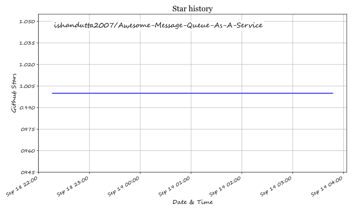

# Awesome-Message-Queue-As-A-Service

## Top Message Queue as a Service Ecosystem


### SaaS / Hosted Platforms & Open-Source Message Queue, Message Broker, Pub/Sub and Event-Streaming Projects


> A comprehensive GitHub-oriented reference for **Message Queue as a Service (MQaaS)**, managed message brokers, pub/sub platforms, event buses, streaming systems, MQTT brokers, task queues, and their **open-source/self-hosted equivalents**.


**Primary emphasis:** Open-source and self-hostable technologies

**Last Updated:** September 2026


---


## Table of Contents


* [Overview](#overview)

* [SaaS/Hosted Platforms](#saashosted-platforms)


  * [CloudAMQP](#1-cloudamqp)

  * [Ably](#2-ably)

  * [PubNub](#3-pubnub)

  * [Amazon SQS](#4-amazon-sqs)

  * [Azure Service Bus](#5-azure-service-bus)

  * [Google Cloud Pub/Sub](#6-google-cloud-pubsub)

  * [IronMQ](#7-ironmq)

  * [HiveMQ Cloud](#8-hivemq-cloud)

  * [Upstash QStash](#9-upstash-qstash)

  * [RabbitMQ Cloud](#10-rabbitmq-cloud)

  * [NATS.io Cloud](#11-natsio-cloud)

  * [Memphis.dev](#12-memphisdev)

  * [Aiven RabbitMQ](#13-aiven-rabbitmq)

  * [Redpanda Cloud](#14-redpanda-cloud)

  * [Confluent Cloud](#15-confluent-cloud)

* [Open-Source](#open-source)


  * [Message Brokers](#message-brokers)

  * [Enterprise Messaging](#enterprise-messaging)

  * [Event Streaming](#event-streaming)

  * [Cloud-Native Messaging](#cloud-native-messaging)

  * [MQTT Brokers](#mqtt-brokers)

  * [Lightweight Messaging](#lightweight-messaging)

  * [Queue Servers](#queue-servers)

  * [Serverless Messaging Alternatives](#serverless-messaging-alternatives)

  * [Messaging Libraries](#messaging-libraries)

  * [Workflow and Task Queues](#workflow-and-task-queues)

  * [Messaging Gateways and Integration](#messaging-gateways-and-integration)

  * [Observability](#observability)

* [Additional Open-Source Options](#additional-open-source-options)

* [Commercial → Open-Source Mapping](#commercial--open-source-mapping)

* [Message Queue Capability Matrix](#message-queue-capability-matrix)

* [Recommended Open-Source Architecture](#recommended-open-source-architecture)

* [Best Open-Source Combinations](#best-open-source-combinations)

* [Messaging Patterns](#messaging-patterns)

* [Queue Lifecycle](#queue-lifecycle)

* [Message Delivery Semantics](#message-delivery-semantics)

* [Dead-Letter Queue Architecture](#dead-letter-queue-architecture)

* [Retry Architecture](#retry-architecture)

* [Priority Queue Architecture](#priority-queue-architecture)

* [Delayed Messaging](#delayed-messaging)

* [Pub/Sub Architecture](#pubsub-architecture)

* [Event Streaming Architecture](#event-streaming-architecture)

* [IoT / MQTT Architecture](#iot--mqtt-architecture)

* [Multi-Region Messaging](#multi-region-messaging)

* [Kafka-Compatible Architecture](#kafka-compatible-architecture)

* [Message Ordering](#message-ordering)

* [Exactly-Once vs At-Least-Once](#exactly-once-vs-at-least-once)

* [Message Persistence](#message-persistence)

* [Backpressure](#backpressure)

* [Consumer Scaling](#consumer-scaling)

* [Schema Management](#schema-management)

* [Security](#security)

* [Observability](#observability-1)

* [Performance Engineering](#performance-engineering)

* [Kubernetes Architecture](#kubernetes-architecture)

* [High Availability](#high-availability)

* [Disaster Recovery](#disaster-recovery)

* [Recommended Open-Source Technology Stack](#recommended-open-source-technology-stack)

* [Example Open-Source Message Queue Flow](#example-open-source-message-queue-flow)

* [Reference Enterprise Architecture](#reference-enterprise-architecture)

* [Multi-Queue / Event-Driven Architecture](#multi-queue--event-driven-architecture)

* [Open-Source Maturity](#open-source-maturity)

* [What Open Source Can Replace](#what-open-source-can-replace)

* [What Open Source Does Not Automatically Replace](#what-open-source-does-not-automatically-replace)

* [Testing and Validation](#testing-and-validation)

* [Key Takeaway](#key-takeaway)

* [How to Contribute](#how-to-contribute)

* [Useful Resources](#useful-resources)

* [Disclaimer](#disclaimer)

* [Summary](#summary)


---


# Overview


A **Message Queue as a Service (MQaaS)** platform provides managed infrastructure for asynchronous communication between applications, microservices, workers, devices, and distributed systems.


Typical capabilities include:


* Message queues

* Publish/subscribe

* Event streaming

* Request/reply

* Delayed delivery

* Message retries

* Dead-letter queues

* Message acknowledgements

* Message ordering

* Durable persistence

* Consumer groups

* Fan-out

* Push delivery

* Pull delivery

* Scheduling

* Webhooks

* MQTT

* AMQP

* STOMP

* Kafka protocol compatibility

* HTTP APIs

* WebSocket messaging

* Multi-region replication

* Authentication and authorization

* Monitoring and observability

* Horizontal scaling


The commercial MQaaS ecosystem includes cloud-native services such as Amazon SQS, Azure Service Bus, Google Cloud Pub/Sub, CloudAMQP, Ably, PubNub, HiveMQ Cloud, QStash, Aiven RabbitMQ and NATS Cloud.


At the same time, there is a very large open-source ecosystem capable of replacing significant portions of these platforms.


---


# SaaS/Hosted Platforms


## 1. CloudAMQP


**Type:** Managed RabbitMQ / AMQP


CloudAMQP provides hosted RabbitMQ clusters without requiring users to operate RabbitMQ infrastructure.


### Typical capabilities


* RabbitMQ clusters

* AMQP messaging

* Queues

* Exchanges

* Routing

* Dead-lettering

* TLS

* Monitoring

* High availability

* Managed infrastructure


### Open-source equivalents


* RabbitMQ

* LavinMQ

* Apache ActiveMQ Artemis

* Apache Qpid Broker-J

* NATS

* Apache Pulsar


---


## 2. Ably


**Type:** Managed realtime messaging / Pub/Sub


Ably provides realtime publish/subscribe infrastructure where publishers and subscribers communicate through channels.


### Typical use cases


* Realtime applications

* Notifications

* Collaboration

* Chat

* Presence

* Live dashboards

* WebSockets

* Event-driven applications


### Open-source alternatives


* NATS

* Apache Pulsar

* RabbitMQ

* EMQX

* Eclipse Mosquitto

* Centrifugo

* Mercure

* Redis Pub/Sub

* Valkey Pub/Sub


---


## 3. PubNub


**Type:** Realtime Pub/Sub platform


Typical applications include:


* Chat

* Presence

* Multiplayer applications

* Realtime dashboards

* Notifications

* IoT

* Device communication


### Open-source alternatives


* NATS

* Apache Pulsar

* RabbitMQ

* EMQX

* Mosquitto

* Centrifugo

* Redis / Valkey

* Kafka


---


## 4. Amazon SQS


**Type:** Managed message queue


Typical capabilities:


* Standard queues

* FIFO queues

* Visibility timeout

* Message retention

* Dead-letter queues

* Delay queues

* Long polling

* Horizontal consumer scaling


### Open-source alternatives


* RabbitMQ

* Apache ActiveMQ Artemis

* Apache RocketMQ

* NATS JetStream

* Apache Pulsar

* LavinMQ

* Beanstalkd


---


## 5. Azure Service Bus


**Type:** Enterprise managed messaging


Typical capabilities:


* Queues

* Topics

* Subscriptions

* Dead-letter queues

* Sessions

* Message ordering

* Transactions

* Duplicate detection

* AMQP


### Open-source alternatives


* RabbitMQ

* Apache ActiveMQ Artemis

* Apache Qpid

* Apache Pulsar

* NATS JetStream

* Apache RocketMQ


---


## 6. Google Cloud Pub/Sub


**Type:** Managed asynchronous messaging / event bus


Typical capabilities:


* Topics

* Subscriptions

* Push delivery

* Pull delivery

* Message retention

* Filtering

* Dead-letter topics

* Horizontal scaling

* Event-driven architectures


### Open-source alternatives


* Apache Pulsar

* NATS JetStream

* RabbitMQ

* Apache Kafka

* Apache RocketMQ

* Redpanda


---


## 7. IronMQ


**Type:** Hosted message queue


Typical use cases:


* Background jobs

* Distributed workers

* Asynchronous processing

* Application decoupling

* Reliable task delivery


### Open-source alternatives


* RabbitMQ

* NATS JetStream

* ActiveMQ Artemis

* LavinMQ

* Beanstalkd


---


## 8. HiveMQ Cloud


**Type:** Managed MQTT messaging platform


HiveMQ is designed around MQTT and cloud-native IoT messaging. HiveMQ Cloud provides a managed broker offering.


### Typical use cases


* IoT

* IIoT

* Connected devices

* Telemetry

* Device commands

* Industrial systems


### Open-source alternatives


* EMQX

* Eclipse Mosquitto

* NanoMQ

* VerneMQ

* HiveMQ Community Edition


---


## 9. Upstash QStash


**Type:** Serverless messaging and scheduling


QStash acts as a middleware layer between applications and HTTP endpoints, supporting delivery guarantees and automatic retries.


### Typical use cases


* Serverless background jobs

* HTTP callbacks

* Scheduled jobs

* Delayed jobs

* Webhooks

* Retryable APIs


### Open-source alternatives


* NATS JetStream

* RabbitMQ

* Apache Kafka

* Apache Pulsar

* Redis / Valkey

* Temporal

* Celery + RabbitMQ

* BullMQ + Redis / Valkey


---


## 10. RabbitMQ Cloud


**Type:** Managed RabbitMQ


Provides managed RabbitMQ infrastructure for:


* AMQP

* Queues

* Exchanges

* Routing

* Workers

* Microservices

* Event-driven applications


RabbitMQ itself is free and open source under the Mozilla Public License 2.0.


### Open-source equivalent


* RabbitMQ


---


## 11. NATS.io Cloud


**Type:** Managed NATS


NATS provides:


* Pub/Sub

* Request/Reply

* Queueing

* Streaming

* Persistence

* JetStream

* Key-value storage

* Object storage


The NATS server and official clients are open source under Apache 2.0.


### Open-source equivalent


* NATS Server

* NATS JetStream


---


## 12. Memphis.dev


**Type:** Event-driven messaging / streaming platform


Memphis provides a broker-oriented developer experience with:


* Message stations

* Producers

* Consumers

* Dead-letter queues

* Schema management

* Observability

* Kubernetes deployment


The project describes itself as an open-source real-time data-processing platform, although its current licensing includes business-source restrictions, so it should not automatically be treated as permissive open source for every use case.


### Alternatives


* NATS

* Apache Pulsar

* RabbitMQ

* Apache Kafka

* Apache RocketMQ


---


## 13. Aiven RabbitMQ


**Type:** Managed RabbitMQ


A managed RabbitMQ offering designed to remove operational burden from:


* Cluster deployment

* Scaling

* Monitoring

* Availability

* Security

* Upgrades


### Open-source equivalent


* RabbitMQ


---


## 14. Redpanda Cloud


**Type:** Managed event streaming


Redpanda provides a Kafka-compatible streaming platform with self-managed and cloud deployment models.


### Important licensing distinction


Redpanda Community Edition is **source-available under the Business Source License**, rather than a conventional OSI-approved open-source license.


### Alternatives


* Apache Kafka

* Apache Pulsar

* NATS

* Apache RocketMQ


---


## 15. Confluent Cloud


**Type:** Managed Apache Kafka ecosystem


Typical capabilities:


* Event streaming

* Kafka clusters

* Connectors

* Stream processing

* Schema management

* Event integration

* Governance


### Open-source alternatives


* Apache Kafka

* Apache Pulsar

* NATS

* Apache RocketMQ

* RabbitMQ


---


# Open-Source


## 1. RabbitMQ


**Repository:**

https://github.com/rabbitmq/rabbitmq-server


**License:** Mozilla Public License 2.0


RabbitMQ is a mature open-source messaging and streaming broker.


### Features


* AMQP

* Queues

* Exchanges

* Routing

* Pub/Sub

* Dead-letter exchanges

* TTL

* Priority queues

* Clustering

* Federation

* Shovel

* TLS

* Authentication

* Authorization

* Management UI


### Best suited for


* Microservices

* Enterprise queues

* Background jobs

* Workflow processing

* Task distribution

* Traditional message-oriented middleware


---


# Message Brokers


## 2. Apache ActiveMQ Artemis


**Repository:**

https://github.com/apache/activemq-artemis


**License:** Apache 2.0


Apache ActiveMQ Artemis is an open-source, high-performance, clustered asynchronous messaging system with multi-protocol support.


### Features


* AMQP

* MQTT

* STOMP

* JMS

* Core protocol

* High availability

* Clustering

* Persistence

* Message groups

* Transactions

* Failover


---


## 3. Apache ActiveMQ


https://github.com/apache/activemq


Apache ActiveMQ is a mature multi-protocol Java message broker supporting AMQP, MQTT, STOMP and JMS.


### Best suited for


* Enterprise messaging

* Legacy JMS applications

* Java applications

* Integration middleware


---


## 4. Apache Qpid Broker-J


https://github.com/apache/qpid-broker-j


### Features


* AMQP

* Java

* Authentication

* Authorization

* Persistence

* Clustering

* Enterprise messaging


---


## 5. Apache RocketMQ


https://github.com/apache/rocketmq


**License:** Apache 2.0


RocketMQ implements producer/consumer and Pub/Sub messaging models and supports persistent message queues.


### Features


* Pub/Sub

* Ordered messages

* Delayed messages

* Transactional messages

* Message persistence

* Consumer groups

* High throughput

* Distributed architecture


---


# Event Streaming


## 6. Apache Kafka


https://github.com/apache/kafka


**License:** Apache 2.0


Apache Kafka is an open-source distributed event-streaming platform used for durable event pipelines, streaming analytics, data integration and event-driven applications.


### Features


* Durable event logs

* Topics

* Partitions

* Consumer groups

* Replication

* Retention

* Replay

* Stream processing

* Kafka Connect

* Transactions

* Exactly-once processing


### Best suited for


* Event streaming

* Data pipelines

* Event sourcing

* Analytics

* Large-scale distributed systems


---


## 7. Apache Pulsar


https://github.com/apache/pulsar


**License:** Apache 2.0


Apache Pulsar is an open-source distributed messaging and streaming platform designed for cloud environments.


### Features


* Messaging

* Streaming

* Multi-tenancy

* Geo-replication

* Tiered storage

* Topic-based architecture

* Functions

* Connectors

* Multiple subscription modes


### Particularly useful for


* Multi-tenant messaging

* Global event systems

* Hybrid queue + streaming architectures

* Large topic counts


---


## 8. Redpanda


https://github.com/redpanda-data/redpanda


Redpanda provides a Kafka-compatible streaming platform. Its Community Edition is source-available under BSL rather than a conventional OSI-approved open-source license.


### Use cases


* Kafka-compatible applications

* Event streaming

* Data pipelines

* Low-latency workloads


---


# Cloud-Native Messaging


## 9. NATS


https://github.com/nats-io/nats-server


**License:** Apache 2.0


NATS is a lightweight, high-performance messaging system supporting Pub/Sub, request/reply, queueing and persistent streaming through JetStream.


### Features


* Pub/Sub

* Request/Reply

* Queue groups

* JetStream

* Persistence

* Key-value

* Object store

* Clustering

* Leaf nodes


### Excellent for


* Microservices

* Cloud-native systems

* Edge computing

* Service communication

* Low-latency messaging


---


## 10. NATS JetStream


JetStream extends NATS with:


* Persistent streams

* Consumers

* Acknowledgements

* Replay

* Retention policies

* Durable consumers

* Work queues


It is particularly relevant when building an open-source alternative to managed queue services.


---


# MQTT Brokers


## 11. Eclipse Mosquitto


https://github.com/eclipse-mosquitto/mosquitto


**License:** EPL-2.0 / EDL-1.0


### Features


* MQTT 5

* MQTT 3.1.1

* TLS

* Authentication

* Persistence

* Bridges

* Lightweight deployment


### Best suited for


* IoT

* Sensors

* Edge devices

* Telemetry

* Home automation


---


## 12. EMQX


https://github.com/emqx/emqx


### Features


* MQTT

* IoT messaging

* Clustering

* WebSocket

* Rule engine

* Authentication

* Authorization

* Integration

* Distributed deployment


### Suitable for


* IoT platforms

* Industrial messaging

* Device telemetry

* Large MQTT deployments


---


## 13. NanoMQ


https://github.com/emqx/nanomq


**Type:** Lightweight MQTT broker


### Best suited for


* Edge

* Embedded systems

* Industrial IoT

* Gateways

* Resource-constrained environments


---


## 14. VerneMQ


https://github.com/vernemq/vernemq


**Type:** Distributed MQTT broker


### Features


* MQTT

* Clustering

* High availability

* Authentication

* Authorization

* WebSocket

* Plugin ecosystem


---


# Lightweight Messaging


## 15. ZeroMQ


https://github.com/zeromq/libzmq


ZeroMQ is an open-source messaging library rather than a traditional centralized broker. It supports patterns such as Pub/Sub, request/reply and task distribution.


### Advantages


* Brokerless architecture

* Very low overhead

* In-process messaging

* Inter-process messaging

* TCP

* Multicast

* WebSocket

* Pub/Sub

* Push/Pull


### Important


ZeroMQ should not be considered a direct drop-in replacement for Amazon SQS or RabbitMQ because its architecture is fundamentally different.


---


# Queue Servers


## 16. LavinMQ


https://github.com/cloudamqp/lavinmq


LavinMQ is an open-source message queue and streaming server implementing AMQP 0-9-1 and MQTT protocols. It is built with Crystal and uses a disk-first storage approach.


### Features


* AMQP

* MQTT

* Persistent queues

* Streaming

* Low resource requirements

* Kubernetes support

* Apache 2.0 license


---


## 17. Beanstalkd


https://github.com/beanstalkd/beanstalkd


**Type:** Lightweight work queue


### Features


* Simple queue model

* Job processing

* Delayed jobs

* Priorities

* Worker pools

* Minimal operational complexity


### Best suited for


* Background jobs

* Small services

* Worker systems

* Simple asynchronous processing


---


## 18. NSQ


https://github.com/nsqio/nsq


**Type:** Distributed real-time messaging platform


### Features


* Distributed queues

* Pub/Sub

* Horizontal scaling

* Discovery

* Fault tolerance

* Go ecosystem


---


# Serverless Messaging Alternatives


## 19. Temporal


https://github.com/temporalio/temporal


**Type:** Durable workflow orchestration


Temporal is not a conventional message broker, but can replace queue-centric architectures when the actual requirement is:


* Durable workflows

* Retries

* Scheduling

* Long-running jobs

* Stateful orchestration

* Reliable execution


---


## 20. BullMQ


https://github.com/taskforcesh/bullmq


**Type:** Redis-backed job queue


### Features


* Background jobs

* Delayed jobs

* Repeatable jobs

* Retries

* Priorities

* Concurrency

* Worker processing


---


## 21. Celery


https://github.com/celery/celery


**Type:** Distributed task queue framework


Common brokers include:


* RabbitMQ

* Redis

* Amazon SQS


### Best suited for


* Python background jobs

* Distributed workers

* Scheduled tasks

* Async execution


---


# Messaging Libraries


## 22. nanomsg


https://github.com/nanomsg/nanomsg


A lightweight messaging library inspired by ZeroMQ.


---


## 23. NNG


https://github.com/nanomsg/nng


Successor-oriented messaging library implementing scalable messaging patterns.


### Patterns


* Pub/Sub

* Request/Reply

* Pipeline

* Pair

* Bus

* Survey


---


## 24. Redis / Valkey Messaging


### Redis


https://github.com/redis/redis


### Valkey


https://github.com/valkey-io/valkey


### Messaging capabilities


* Pub/Sub

* Streams

* Consumer groups

* Lists

* Blocking queues

* Persistence

* Distributed locks


Redis/Valkey can serve as a lightweight queue backend, although dedicated brokers may provide richer messaging semantics.


---


# Messaging Gateways and Integration


## 25. Apache Camel


https://github.com/apache/camel


Enterprise integration framework supporting:


* Routing

* Message transformation

* Queues

* Kafka

* RabbitMQ

* MQTT

* HTTP

* JMS

* Cloud services


---


## 26. Apache NiFi


https://github.com/apache/nifi


Useful for:


* Data movement

* Message ingestion

* Transformation

* Routing

* Kafka integration

* MQTT integration

* HTTP ingestion


---


## 27. Node-RED


https://github.com/node-red/node-red


Useful for:


* MQTT

* HTTP

* Webhooks

* IoT

* Message routing

* Rapid integration

* Edge systems


---


# Observability


## 28. Prometheus


https://github.com/prometheus/prometheus


Useful for:


* Broker metrics

* Consumer lag

* Queue depth

* Throughput

* Error rates

* Latency


---


## 29. Grafana


https://github.com/grafana/grafana


Useful for:


* Queue dashboards

* Consumer dashboards

* Broker health

* Message throughput

* Latency

* Alerting


---


## 30. OpenTelemetry


https://github.com/open-telemetry/opentelemetry-collector


Useful for:


* Distributed tracing

* Metrics

* Logs

* Cross-service message tracing


---


# Additional Open-Source Options


| Project          | Primary Function      | Protocol / Model    | Typical Use                |

| ---------------- | --------------------- | ------------------- | -------------------------- |

| RabbitMQ         | Message broker        | AMQP                | Enterprise queues          |

| NATS             | Messaging             | NATS                | Cloud-native microservices |

| Apache Kafka     | Event streaming       | Kafka               | Event platforms            |

| Apache Pulsar    | Messaging + streaming | Pulsar              | Global messaging           |

| ActiveMQ Artemis | Enterprise messaging  | AMQP/JMS/MQTT/STOMP | Enterprise integration     |

| Apache RocketMQ  | Distributed messaging | RocketMQ            | High-volume messaging      |

| LavinMQ          | Queue + streaming     | AMQP/MQTT           | RabbitMQ alternative       |

| EMQX             | MQTT broker           | MQTT                | IoT                        |

| Mosquitto        | MQTT broker           | MQTT                | Lightweight IoT            |

| VerneMQ          | MQTT broker           | MQTT                | Distributed IoT            |

| NanoMQ           | Edge MQTT             | MQTT                | Edge/IIoT                  |

| ZeroMQ           | Messaging library     | ZMTP                | Brokerless systems         |

| NNG              | Messaging library     | Nanomsg patterns    | Distributed applications   |

| NSQ              | Distributed messaging | NSQ                 | Realtime queues            |

| Beanstalkd       | Work queue            | Custom              | Background jobs            |

| Redis            | Data + messaging      | Redis protocol      | Queues/cache               |

| Valkey           | Data + messaging      | Redis-compatible    | Queues/cache               |

| BullMQ           | Job queue             | Redis               | Background jobs            |

| Celery           | Task queue            | Multiple brokers    | Python workers             |

| Temporal         | Workflow engine       | Workflow APIs       | Durable workflows          |

| Apache Camel     | Integration           | Multi-protocol      | Enterprise integration     |

| Apache NiFi      | Dataflow              | Multi-protocol      | Data movement              |

| Node-RED         | Integration           | Multi-protocol      | IoT/edge                   |

| Prometheus       | Monitoring            | Metrics             | Broker monitoring          |

| Grafana          | Visualization         | Metrics/logs        | Operations                 |

| OpenTelemetry    | Observability         | OTLP                | Distributed tracing        |


---


# Commercial → Open-Source Mapping


| SaaS / Hosted Platform  | Primary Capability          | Open-Source Building Blocks         |

| ----------------------- | --------------------------- | ----------------------------------- |

| CloudAMQP               | Managed RabbitMQ            | RabbitMQ / LavinMQ                  |

| Ably                    | Realtime Pub/Sub            | NATS / Pulsar / Centrifugo          |

| PubNub                  | Realtime messaging          | NATS / Pulsar / EMQX                |

| Amazon SQS              | Managed queues              | RabbitMQ / NATS JetStream / Artemis |

| Azure Service Bus       | Enterprise messaging        | RabbitMQ / Artemis / Qpid           |

| Google Cloud Pub/Sub    | Managed Pub/Sub             | Pulsar / NATS / Kafka               |

| IronMQ                  | Hosted queues               | RabbitMQ / NATS / Beanstalkd        |

| HiveMQ Cloud            | Managed MQTT                | EMQX / Mosquitto / VerneMQ          |

| Upstash QStash          | HTTP messaging / scheduling | NATS / RabbitMQ / Temporal          |

| RabbitMQ Cloud          | Managed RabbitMQ            | RabbitMQ                            |

| NATS Cloud              | Managed NATS                | NATS Server + JetStream             |

| Memphis.dev             | Queue/event platform        | NATS / Pulsar / Kafka               |

| Aiven RabbitMQ          | Managed RabbitMQ            | RabbitMQ                            |

| Redpanda Cloud          | Event streaming             | Apache Kafka / Pulsar               |

| Confluent Cloud         | Managed Kafka               | Apache Kafka                        |

| MQTT SaaS               | IoT messaging               | EMQX / Mosquitto / VerneMQ          |

| Managed task queues     | Background jobs             | Celery / BullMQ / RabbitMQ          |

| Managed workflow queues | Durable execution           | Temporal                            |

| Managed integration     | Message routing             | Apache Camel / Node-RED             |


---


# Message Queue Capability Matrix


| Capability        |   RabbitMQ |         NATS |        Kafka |          Pulsar |    Artemis |    RocketMQ |       EMQX |    SQS-like |

| ----------------- | ---------: | -----------: | -----------: | --------------: | ---------: | ----------: | ---------: | ----------: |

| Traditional Queue |          ✅ |            ✅ |           ⚠️ |               ✅ |          ✅ |           ✅ |         ⚠️ |           ✅ |

| Pub/Sub           |          ✅ |            ✅ |            ✅ |               ✅ |          ✅ |           ✅ |          ✅ |          ⚠️ |

| Event Streaming   |         ⚠️ |            ✅ |            ✅ |               ✅ |         ⚠️ |           ✅ |         ⚠️ |          ⚠️ |

| MQTT              |     Plugin |            ❌ |            ❌ |          Plugin |          ✅ |      Plugin |          ✅ |           ❌ |

| AMQP              |          ✅ |            ❌ |            ❌ |          Plugin |          ✅ |           ❌ |          ❌ |         API |

| Persistence       |          ✅ |            ✅ |            ✅ |               ✅ |          ✅ |           ✅ |          ✅ |           ✅ |

| Consumer Groups   |         ⚠️ |            ✅ |            ✅ |               ✅ |         ⚠️ |           ✅ |         ⚠️ |         N/A |

| Replay            |         ⚠️ |            ✅ |            ✅ |               ✅ |         ⚠️ |           ✅ |         ⚠️ |     Limited |

| Ordering          |          ✅ |            ✅ |    Partition |       Partition |          ✅ |           ✅ |      Topic | FIFO option |

| DLQ               |          ✅ |            ✅ |      Pattern |               ✅ |          ✅ |           ✅ |      Rules |           ✅ |

| Delayed Delivery  |     Plugin |      Pattern |      Pattern |         Pattern |          ✅ |           ✅ | Rule-based |           ✅ |

| Transactions      |          ✅ |      Pattern |            ✅ |               ✅ |          ✅ |           ✅ |    Limited |     Limited |

| Multi-Region      | Federation | Cluster/Leaf |  Replication | Geo-replication | Federation | Replication |    Cluster |       Cloud |

| HTTP API          |     Plugin |          API | REST/clients |             API | Management |         API |        API |           ✅ |

| WebSockets        |     Plugin |      Gateway |      Gateway |         Gateway |     Plugin |     Gateway |          ✅ |           ❌ |

| IoT               |       Good |         Good |         Good |            Good |       Good |        Good |  Excellent |     Limited |

| Cloud Native      |  Excellent |    Excellent |    Excellent |       Excellent |       Good |        Good |  Excellent |   Excellent |


---


# Recommended Open-Source Architecture


```text

                         ┌──────────────────────────────┐

                         │        Applications          │

                         │ Web / Mobile / API / IoT    │

                         └──────────────┬───────────────┘

                                        │

                              HTTP / gRPC / MQTT

                                        │

                                        ▼

                         ┌──────────────────────────────┐

                         │     API / Gateway Layer      │

                         │ NGINX / Envoy / Node-RED    │

                         └──────────────┬───────────────┘

                                        │

                    ┌───────────────────┼───────────────────┐

                    │                   │                   │

                    ▼                   ▼                   ▼

             ┌───────────┐      ┌────────────┐      ┌────────────┐

             │ RabbitMQ  │      │    NATS    │      │   Pulsar   │

             │   Queue   │      │ JetStream  │      │  Streaming │

             └─────┬─────┘      └──────┬─────┘      └──────┬─────┘

                   │                   │                   │

                   └───────────────────┼───────────────────┘

                                       │

                                       ▼

                             ┌─────────────────┐

                             │ Worker / Stream │

                             │   Processing    │

                             └────────┬────────┘

                                      │

                       ┌──────────────┼──────────────┐

                       ▼              ▼              ▼

                   PostgreSQL       Redis         Analytics

```


---


# Best Open-Source Combinations


## 1. Amazon SQS-style Queue


```text

RabbitMQ

    +

RabbitMQ Management

    +

Prometheus

    +

Grafana

```


Alternative:


```text

NATS

    +

JetStream

    +

Prometheus

    +

Grafana

```


---


## 2. Azure Service Bus-style Enterprise Messaging


```text

RabbitMQ

    +

Apache ActiveMQ Artemis

    +

Apache Camel

    +

PostgreSQL

    +

Prometheus

    +

Grafana

```


---


## 3. Google Pub/Sub-style Architecture


```text

Apache Pulsar

      +

Pulsar Functions

      +

Connectors

      +

Schema Management

      +

Prometheus

      +

Grafana

```


---


## 4. Ably / PubNub-style Realtime Messaging


```text

NATS

   +

WebSocket Gateway

   +

Centrifugo

   +

Redis / Valkey

   +

PostgreSQL

   +

Grafana

```


---


## 5. CloudAMQP / RabbitMQ Cloud Alternative


```text

RabbitMQ Cluster

       +

RabbitMQ Management

       +

HAProxy / Load Balancer

       +

Prometheus

       +

Grafana

       +

Kubernetes

```


---


## 6. HiveMQ Cloud Alternative


```text

EMQX Cluster

      +

MQTT

      +

WebSocket

      +

Rule Engine

      +

PostgreSQL

      +

Prometheus

      +

Grafana

```


---


## 7. Upstash QStash Alternative


```text

HTTP API

    │

    ▼

NATS / RabbitMQ

    │

    ├── Retry

    ├── Delay

    ├── DLQ

    └── Worker

         │

         ▼

       API

```


For durable workflow requirements:


```text

Application

     │

     ▼

Temporal

     │

     ├── Retry

     ├── Scheduling

     ├── Timeout

     └── Workflow State

```


---


# Messaging Patterns


## Point-to-Point


```text

Producer

   │

   ▼

Queue

   │

   ▼

Consumer

```


Only one consumer normally processes each message.


---


## Publish / Subscribe


```text

                 ┌── Consumer A

                 │

Publisher ─ Topic ├── Consumer B

                 │

                 └── Consumer C

```


---


## Work Queue


```text

                 ┌── Worker A

                 │

Producer → Queue ├── Worker B

                 │

                 └── Worker C

```


---


## Fan-Out


```text

                  ┌── Service A

                  │

Event → Exchange ─┼── Service B

                  │

                  └── Service C

```


---


## Request / Reply


```text

Client

  │

  ▼

Request

  │

  ▼

Service

  │

  ▼

Response

```


NATS and ZeroMQ are particularly suitable for this communication pattern.


---


# Queue Lifecycle


```text

Producer

   │

   ▼

Message Created

   │

   ▼

Message Accepted

   │

   ▼

Queue / Topic

   │

   ├── Retry

   ├── Delay

   ├── Priority

   └── Expiration

   │

   ▼

Consumer

   │

   ▼

Processing

   │

   ├── ACK

   │

   ├── NACK

   │

   └── Failure

         │

         ▼

       Retry

         │

         ▼

        DLQ

```


---


# Message Delivery Semantics


## At-Most-Once


```text

Message → Consumer

          │

          └── No retry

```


Possible outcome:


```text

Message may be lost

```


Useful where duplicates are more harmful than loss.


---


## At-Least-Once


```text

Message

   │

   ▼

Consumer

   │

   ├── ACK → Complete

   │

   └── Failure → Retry

```


Possible outcome:


```text

Duplicate delivery

```


This is the most common practical model for reliable distributed systems.


---


## Exactly-Once


Exactly-once semantics generally require coordination across:


* Producer

* Broker

* Consumer

* Storage

* Transactions

* Idempotency


A practical design often combines:


```text

At-Least-Once Delivery

        +

Idempotent Consumer

        +

Transactional / Atomic State Update

```


---


# Dead-Letter Queue Architecture


```text

                ┌──────────────┐

                │    Queue     │

                └──────┬───────┘

                       │

                    Consumer

                       │

                 ┌─────┴─────┐

                 │           │

                ACK        Failure

                 │           │

                 ▼           ▼

              Success      Retry

                               │

                               ▼

                         Retry Limit

                               │

                               ▼

                             DLQ

```


DLQ should preserve:


* Original message

* Original queue/topic

* Failure reason

* Retry count

* Timestamp

* Consumer identity

* Correlation ID


---


# Retry Architecture


```text

Message

   │

   ▼

Attempt 1

   │

 Failure

   ▼

Delay

   │

   ▼

Attempt 2

   │

 Failure

   ▼

Exponential Backoff

   │

   ▼

Attempt N

   │

 Failure

   ▼

DLQ

```


Recommended strategy:


```text

delay = min(maxDelay, baseDelay × 2^retryCount)

```


Add jitter to avoid synchronized retry storms.


---


# Priority Queue Architecture


```text

                 ┌── High Priority

Producer ────────┼── Normal Priority

                 └── Low Priority

                        │

                        ▼

                     Workers

```


RabbitMQ, Artemis and several queue systems support priority-oriented designs.


---


# Delayed Messaging


Typical use cases:


* Scheduled notifications

* Retry backoff

* Payment retries

* Reminder systems

* Delayed workflows

* Rate limiting


```text

Producer

   │

   ▼

Delayed Queue

   │

   ▼

Timer / TTL

   │

   ▼

Processing Queue

   │

   ▼

Consumer

```


---


# Pub/Sub Architecture


```text

                       ┌── Subscriber A

                       │

Publisher ── Topic ────┼── Subscriber B

                       │

                       ├── Subscriber C

                       │

                       └── Subscriber D

```


Suitable for:


* Notifications

* Domain events

* Microservices

* Realtime applications

* IoT

* Analytics


---


# Event Streaming Architecture


```text

                  ┌─────────────┐

Producer ────────►│    Topic    │

                  │ Partitions  │

                  └──────┬──────┘

                         │

            ┌────────────┼────────────┐

            ▼            ▼            ▼

       Consumer A   Consumer B   Consumer C

            │            │            │

            └────────────┼────────────┘

                         ▼

                    Data Platform

```


Best suited for:


* Apache Kafka

* Apache Pulsar

* Redpanda

* RocketMQ

* NATS JetStream


---


# IoT / MQTT Architecture


```text

Sensors / Devices

        │

        │ MQTT

        ▼

   MQTT Broker

        │

   ┌────┼─────┐

   ▼    ▼     ▼

Rules  Stream Analytics

   │          │

   ▼          ▼

Database    Dashboard

```


Recommended open-source stack:


```text

EMQX / Mosquitto

       +

Node-RED

       +

PostgreSQL

       +

Prometheus

       +

Grafana

```


---


# Multi-Region Messaging


```text

             Region A

        ┌──────────────┐

        │ Broker A     │

        └──────┬───────┘

               │

          Replication

               │

        ┌──────▼───────┐

        │ Broker B     │

        └──────────────┘

             Region B

```


Important design considerations:


* Replication

* Failover

* Message duplication

* Ordering

* Clock differences

* Network partitions

* Data residency

* Disaster recovery

* RPO

* RTO


Apache Pulsar, Kafka, RabbitMQ and NATS provide different approaches to distributed messaging and replication.


---


# Kafka-Compatible Architecture


```text

Producer

   │

   ▼

Kafka API

   │

   ▼

Kafka-Compatible Broker

   │

   ├── Apache Kafka

   ├── Redpanda

   └── Other compatible systems

   │

   ▼

Consumer Groups

```


Apache Kafka remains the reference open-source ecosystem for event streaming.


---


# Message Ordering


Ordering can exist at different scopes:


```text

Global ordering

       ↓

Topic ordering

       ↓

Partition ordering

       ↓

Key ordering

       ↓

Queue ordering

```


Do not assume that a distributed messaging system provides global ordering merely because individual queues or partitions preserve order.


---


# Exactly-Once vs At-Least-Once


| Model            | Reliability | Duplicate Risk                           | Complexity |

| ---------------- | ----------- | ---------------------------------------- | ---------- |

| At-most-once     | Lower       | Low                                      | Low        |

| At-least-once    | High        | Possible                                 | Medium     |

| Effectively-once | High        | Controlled through idempotency           | Medium     |

| Exactly-once     | High        | Reduced through transactional mechanisms | High       |


For many applications:


```text

At-Least-Once

+

Idempotent Consumers

```


is a practical architecture.


---


# Message Persistence


Persistent messaging generally requires:


```text

Producer

   │

   ▼

Broker

   │

   ▼

Durable Storage

   │

   ▼

Replication

```


Storage choices may include:


* Local SSD

* NVMe

* RAID

* Object storage

* Distributed logs

* Database-backed persistence


---


# Backpressure


Backpressure prevents producers from overwhelming consumers.


```text

Fast Producer

      │

      ▼

 ┌───────────┐

 │   Queue   │

 └─────┬─────┘

       │

       ▼

Slow Consumer

```


Controls include:


* Queue limits

* Consumer concurrency

* Rate limiting

* Prefetch

* Flow control

* Partition scaling

* Batch consumption


NATS, RabbitMQ, Kafka and Pulsar provide different mechanisms for flow control and consumer management.


---


# Consumer Scaling


```text

                    ┌── Worker 1

                    │

Queue ──────────────┼── Worker 2

                    │

                    ├── Worker 3

                    │

                    └── Worker N

```


Scaling dimensions include:


* Number of consumers

* Number of partitions

* Queue depth

* Processing latency

* CPU

* Memory

* Network bandwidth


---


# Schema Management


For event-driven systems, schemas should be versioned.


```text

Producer

   │

   ▼

Schema

   │

   ▼

Message

   │

   ▼

Broker

   │

   ▼

Consumer

```


Common formats:


* JSON

* Avro

* Protobuf

* JSON Schema

* MessagePack


Schema compatibility modes:


* Backward compatible

* Forward compatible

* Full compatible


---


# Security


## Authentication


Common mechanisms:


* TLS certificates

* Username/password

* OAuth

* JWT

* SASL

* API keys

* mTLS


---


## Authorization


Use:


```text

User

  │

  ▼

Identity

  │

  ▼

Role

  │

  ▼

Topic / Queue Permission

```


Principle:


```text

Least Privilege

```


---


## Encryption


Recommended:


```text

TLS

+

Encryption at Rest

+

Secret Management

```


Open-source secret-management options include:


* HashiCorp Vault

* Kubernetes Secrets

* External Secrets Operator

* SOPS


---


# Observability


A production message platform should monitor:


### Broker


* CPU

* Memory

* Disk

* Network

* Connections

* Cluster health


### Queue


* Queue depth

* Message age

* Message rate

* Retry rate

* DLQ size


### Consumer


* Consumer lag

* Processing latency

* Error rate

* Throughput

* ACK rate


### Platform


```text

Prometheus

    +

Grafana

    +

OpenTelemetry

    +

Loki / Elasticsearch

```


---


# Performance Engineering


Important metrics:


```text

Throughput

Messages / second

Bytes / second


Latency

P50

P95

P99


Reliability

Error rate

Retry rate

DLQ rate


Consumer performance

Lag

Processing time

Concurrency

```


Performance depends on:


* Message size

* Persistence

* Replication

* Number of partitions

* Network

* Disk

* Consumer processing

* Serialization

* Batch size


---


# Kubernetes Architecture


```text

                  Kubernetes

                       │

          ┌────────────┼─────────────┐

          │            │             │

          ▼            ▼             ▼

      RabbitMQ       NATS         Pulsar

       Cluster      Cluster        Cluster

          │            │             │

          └────────────┼─────────────┘

                       │

                       ▼

                Applications

```


Useful Kubernetes components:


* Kubernetes Operators

* StatefulSets

* Persistent Volumes

* Services

* Ingress

* NetworkPolicies

* Secrets

* Prometheus Operator


---


# High Availability


```text

             Load Balancer

                   │

        ┌──────────┼──────────┐

        ▼          ▼          ▼

      Node A     Node B     Node C

        │          │          │

        └──────────┼──────────┘

                   ▼

             Replicated Data

```


HA mechanisms may include:


* Replication

* Quorum queues

* Leader election

* Cluster membership

* Failover

* Persistent storage


---


# Disaster Recovery


A production messaging platform should define:


```text

RPO

Recovery Point Objective


RTO

Recovery Time Objective

```


Architecture:


```text

Primary Region

      │

      │ Replication / Backup

      ▼

Secondary Region

      │

      ▼

Disaster Recovery

```


Consider:


* Message retention

* Replication

* Backups

* Restore testing

* DNS failover

* Consumer recovery

* Duplicate handling


---


# Recommended Open-Source Technology Stack


## Core Queue


```text

RabbitMQ

```


## Cloud-Native Messaging


```text

NATS + JetStream

```


## Event Streaming


```text

Apache Kafka

```


## Global Messaging


```text

Apache Pulsar

```


## Enterprise Messaging


```text

Apache ActiveMQ Artemis

```


## IoT


```text

EMQX

```


## Lightweight IoT


```text

Eclipse Mosquitto

```


## AMQP Alternative


```text

LavinMQ

```


## Task Queues


```text

Celery

+

RabbitMQ

```


or


```text

BullMQ

+

Redis / Valkey

```


## Durable Workflows


```text

Temporal

```


## Integration


```text

Apache Camel

+

Node-RED

```


## Observability


```text

Prometheus

+

Grafana

+

OpenTelemetry

```


---


# Example Open-Source Message Queue Flow


```text

                     ┌─────────────────┐

                     │   Web / Mobile  │

                     └────────┬────────┘

                              │

                              ▼

                       ┌─────────────┐

                       │ API Gateway │

                       └──────┬──────┘

                              │

                              ▼

                       ┌─────────────┐

                       │  RabbitMQ   │

                       └──────┬──────┘

                              │

              ┌───────────────┼────────────────┐

              ▼               ▼                ▼

        Order Worker     Email Worker      Payment Worker

              │               │                │

              ▼               ▼                ▼

          PostgreSQL        SMTP/API       Payment API

              │

              ▼

          Analytics

```


---


# Reference Enterprise Architecture


```text

                         Applications

                              │

                ┌─────────────┼─────────────┐

                │             │             │

                ▼             ▼             ▼

             REST API       MQTT         WebSocket

                │             │             │

                └─────────────┼─────────────┘

                              ▼

                       API / Gateway

                              │

             ┌────────────────┼─────────────────┐

             │                │                 │

             ▼                ▼                 ▼

        RabbitMQ            NATS             Pulsar

        Queues              JetStream         Streaming

             │                │                 │

             └────────────────┼─────────────────┘

                              │

                     Event Processing

                              │

            ┌─────────────────┼────────────────┐

            ▼                 ▼                ▼

       Microservices      Data Platform      Workers

            │                 │                │

            ▼                 ▼                ▼

       PostgreSQL           Kafka          Object Store

                              │

                              ▼

                       Analytics / BI

                              │

                              ▼

                  Prometheus / Grafana

```


---


# Multi-Queue / Event-Driven Architecture


A large platform can use different brokers for different workloads.


```text

                         Event Platform

                              │

        ┌─────────────────────┼─────────────────────┐

        │                     │                     │

        ▼                     ▼                     ▼

    RabbitMQ                NATS                 Kafka

    Commands               Services              Events

        │                     │                     │

        ▼                     ▼                     ▼

    Workers              Microservices          Analytics

```


This avoids forcing every messaging workload into one technology.


---


# Open-Source Maturity


| Technology       | Primary Role           | Maturity  | Deployment               |

| ---------------- | ---------------------- | --------- | ------------------------ |

| RabbitMQ         | Message broker         | Very High | VM / Docker / Kubernetes |

| Apache Kafka     | Event streaming        | Very High | VM / Docker / Kubernetes |

| Apache Pulsar    | Messaging + streaming  | High      | Kubernetes / VM          |

| NATS             | Cloud-native messaging | High      | VM / Docker / Kubernetes |

| ActiveMQ Artemis | Enterprise messaging   | High      | VM / Kubernetes          |

| RocketMQ         | Distributed messaging  | High      | VM / Kubernetes          |

| EMQX             | MQTT / IoT             | High      | VM / Docker / Kubernetes |

| Mosquitto        | MQTT                   | Very High | Edge / VM / Docker       |

| VerneMQ          | MQTT                   | High      | VM / Docker / Kubernetes |

| LavinMQ          | AMQP queue             | Growing   | VM / Docker / Kubernetes |

| ZeroMQ           | Messaging library      | Very High | Embedded                 |

| NSQ              | Distributed messaging  | Mature    | VM / Kubernetes          |

| Beanstalkd       | Work queue             | Mature    | VM / Docker              |

| BullMQ           | Task queues            | High      | Node.js / Redis          |

| Celery           | Task queues            | Very High | Python                   |

| Temporal         | Durable workflows      | High      | Kubernetes / Cloud       |

| Redpanda         | Event streaming        | High      | VM / Kubernetes          |


---


# What Open Source Can Replace


Open-source infrastructure can replace substantial portions of:


### Amazon SQS


```text

RabbitMQ

NATS JetStream

Artemis

```


### Google Pub/Sub


```text

Apache Pulsar

NATS

Apache Kafka

```


### Azure Service Bus


```text

RabbitMQ

Artemis

Qpid

```


### CloudAMQP


```text

RabbitMQ

LavinMQ

```


### HiveMQ Cloud


```text

EMQX

Mosquitto

VerneMQ

```


### NATS Cloud


```text

NATS Server

+

JetStream

```


### Upstash QStash


```text

NATS

RabbitMQ

Temporal

```


### Confluent Cloud


```text

Apache Kafka

Apache Pulsar

```


---


# What Open Source Does Not Automatically Replace


Running an open-source broker yourself does **not** automatically provide the operational convenience of a managed cloud service.


You remain responsible for:


* Infrastructure

* Networking

* TLS

* Authentication

* Authorization

* Upgrades

* Backups

* Monitoring

* Alerting

* Capacity planning

* Disaster recovery

* Patching

* Incident response

* Multi-region architecture

* Kubernetes operations

* Storage management


Therefore:


```text

Open Source

≠

Zero Operations

```


Instead:


```text

Open Source

+

Automation

+

Observability

+

Platform Engineering

=

Managed-like Experience

```


---


# Testing and Validation


A production message platform should test:


## Functional


* Message delivery

* ACK/NACK

* Retry

* DLQ

* Ordering

* TTL

* Delayed messages


## Performance


* Throughput

* Latency

* Burst traffic

* Consumer scaling

* Large messages


## Reliability


* Broker failure

* Node failure

* Network partition

* Consumer failure

* Producer failure

* Storage failure


## Security


* TLS

* Authentication

* Authorization

* Credential rotation

* Tenant isolation


## Disaster Recovery


```text

Backup

   ↓

Restore

   ↓

Replay

   ↓

Consumer Recovery

   ↓

Validation

```


---


# Recommended Open-Source Message Queue Stack


For a broad enterprise implementation:


```text

                 ┌───────────────────────────┐

                 │       Applications        │

                 └─────────────┬─────────────┘

                               │

                               ▼

                       API / Gateway

                               │

               ┌───────────────┼────────────────┐

               │               │                │

               ▼               ▼                ▼

          RabbitMQ           NATS             Kafka

          Commands        Microservices       Events

               │               │                │

               └───────────────┼────────────────┘

                               │

                               ▼

                         Stream / Workers

                               │

             ┌─────────────────┼─────────────────┐

             ▼                 ▼                 ▼

         PostgreSQL          Redis            Object Store

             │

             ▼

        Business Systems


IoT:

EMQX / Mosquitto

       │

       ▼

   Node-RED

       │

       ▼

   NATS / Kafka

```


---


# Key Takeaway


There is **no single open-source project that perfectly reproduces every feature of every MQaaS platform**.


The open-source ecosystem is better understood as a collection of complementary technologies:


```text

RabbitMQ

   ↓

Traditional Queues / AMQP


NATS + JetStream

   ↓

Cloud-Native Messaging / Request-Reply / Streaming


Apache Kafka

   ↓

Large-Scale Event Streaming


Apache Pulsar

   ↓

Messaging + Streaming + Multi-Tenancy


ActiveMQ Artemis

   ↓

Enterprise Messaging / JMS / AMQP


RocketMQ

   ↓

Distributed Messaging


EMQX / Mosquitto / VerneMQ

   ↓

MQTT / IoT


LavinMQ

   ↓

Lightweight AMQP / MQTT Queue


ZeroMQ / NNG

   ↓

Brokerless Messaging


Celery / BullMQ

   ↓

Background Jobs


Temporal

   ↓

Durable Workflow Orchestration


Prometheus + Grafana

   ↓

Observability

```


For a **general-purpose open-source MQaaS platform**, a particularly flexible architecture is:


```text

RabbitMQ

+

NATS JetStream

+

Apache Kafka / Pulsar

+

EMQX

+

Apache Camel / Node-RED

+

Prometheus

+

Grafana

+

OpenTelemetry

+

Kubernetes

```


For a simpler deployment, start with:


```text

RabbitMQ

+

Prometheus

+

Grafana

+

Kubernetes

```


For cloud-native microservices:


```text

NATS + JetStream

+

Prometheus

+

Grafana

```


For event streaming:


```text

Apache Kafka

+

Kafka Connect

+

Prometheus

+

Grafana

```


For IoT:


```text

EMQX

+

Node-RED

+

PostgreSQL

+

Prometheus

+

Grafana

```


For a unified large-scale platform:


```text

RabbitMQ

      +

NATS

      +

Kafka / Pulsar

      +

EMQX

      +

Camel / Node-RED

      +

Temporal

      +

Prometheus / Grafana

```


---


# How to Contribute


Contributions are welcome.


Useful contribution areas include:


* Additional open-source brokers

* Managed MQaaS providers

* Protocol comparisons

* Benchmark results

* Kubernetes deployment examples

* High-availability configurations

* Multi-region architectures

* Security configurations

* Monitoring dashboards

* Client examples

* Performance testing

* Migration guides


---


# Useful Resources


## Message Brokers


* [RabbitMQ](https://www.rabbitmq.com/)

* [Apache ActiveMQ](https://activemq.apache.org/)

* [Apache ActiveMQ Artemis](https://artemis.apache.org/)

* [Apache Qpid](https://qpid.apache.org/)

* [Apache RocketMQ](https://rocketmq.apache.org/)

* [LavinMQ](https://github.com/cloudamqp/lavinmq)


## Event Streaming


* [Apache Kafka](https://kafka.apache.org/)

* [Apache Pulsar](https://pulsar.apache.org/)

* [Redpanda](https://redpanda.com/)


## Cloud-Native Messaging


* [NATS](https://nats.io/)


## MQTT


* [Eclipse Mosquitto](https://mosquitto.org/)

* [EMQX](https://www.emqx.io/)

* [VerneMQ](https://vernemq.com/)

* [NanoMQ](https://nanomq.io/)


## Messaging Libraries


* [ZeroMQ](https://zeromq.org/)

* [NNG](https://nng.nanomsg.org/)


## Task Queues


* [Celery](https://docs.celeryq.dev/)

* [BullMQ](https://bullmq.io/)

* [Beanstalkd](https://beanstalkd.github.io/)


## Workflow


* [Temporal](https://temporal.io/)


## Observability


* [Prometheus](https://prometheus.io/)

* [Grafana](https://grafana.com/)

* [OpenTelemetry](https://opentelemetry.io/)


---


# Disclaimer


This README is intended as a technical reference for evaluating message queues, brokers, event-streaming platforms, MQTT systems and open-source alternatives.


"Open source", "source available", "community edition" and "commercial managed service" are not interchangeable licensing categories. Licensing should be reviewed directly from the relevant project's current license and terms before deploying or redistributing a system.


Redpanda Community Edition, for example, is explicitly described by Redpanda as source-available under BSL, rather than conventional OSI-approved open source. Memphis.dev likewise has specific business-source restrictions.


---


# Summary


### Top SaaS / Hosted Platforms


```text

CloudAMQP

Ably

PubNub

Amazon SQS

Azure Service Bus

Google Cloud Pub/Sub

IronMQ

HiveMQ Cloud

Upstash QStash

RabbitMQ Cloud

NATS.io Cloud

Memphis.dev

Aiven RabbitMQ

Redpanda Cloud

Confluent Cloud

```


### Top Open-Source Platforms


```text

RabbitMQ

NATS

Apache Kafka

Apache Pulsar

Apache ActiveMQ Artemis

Apache ActiveMQ

Apache RocketMQ

Apache Qpid Broker-J

LavinMQ

EMQX

Eclipse Mosquitto

VerneMQ

NanoMQ

ZeroMQ

NNG

NSQ

Beanstalkd

Redis

Valkey

Celery

BullMQ

Temporal

Apache Camel

Apache NiFi

Node-RED

Prometheus

Grafana

OpenTelemetry

```


## Core Open-Source Recommendation


```text

Traditional Queue

        ↓

RabbitMQ


Cloud-Native Messaging

        ↓

NATS + JetStream


Event Streaming

        ↓

Apache Kafka / Apache Pulsar


Enterprise Messaging

        ↓

ActiveMQ Artemis


IoT / MQTT

        ↓

EMQX / Mosquitto


Lightweight Queue

        ↓

LavinMQ


Brokerless Messaging

        ↓

ZeroMQ / NNG


Background Jobs

        ↓

Celery / BullMQ


Durable Workflows

        ↓

Temporal


Integration

        ↓

Apache Camel / Node-RED


Observability

        ↓

Prometheus + Grafana + OpenTelemetry

```


### Overall Open-Source Architecture


```text

                       MESSAGE PLATFORM

                              │

       ┌──────────────────────┼──────────────────────┐

       │                      │                      │

       ▼                      ▼                      ▼

   RabbitMQ                  NATS                  Kafka

   Queues                  JetStream             Streaming

       │                      │                      │

       └──────────────────────┼──────────────────────┘

                              │

             ┌────────────────┼────────────────┐

             │                │                │

             ▼                ▼                ▼

          Workers         Microservices     Analytics

             │                │                │

             └────────────────┼────────────────┘

                              │

                              ▼

                         Data Platform


        IoT ──► EMQX / Mosquitto ──► NATS / Kafka


        Integration ──► Camel / Node-RED


        Workflows ──► Temporal


        Monitoring ──► Prometheus + Grafana


        Tracing ──► OpenTelemetry

```


**The strongest open-source strategy is therefore not necessarily to find one "SQS replacement" or one "Ably replacement", but to compose the appropriate open-source messaging primitives according to the workload: queues, pub/sub, event streaming, IoT messaging, background jobs, workflow orchestration and observability.**

## Star History

<a href="https://star-history.com/#ishandutta2007/Awesome-Message-Queue-As-A-Service&Timeline" align="center">
  <picture>
    <source media="(prefers-color-scheme: dark)" srcset="assets/ishandutta2007_Awesome-Message-Queue-As-A-Service_growth.svg">
    
  </picture>
</a>
